# Sơ đồ Quan hệ Thực thể (Entity Relationship Diagram - ERD)

Dưới đây là sơ đồ Mermaid mô tả cấu trúc cơ sở dữ liệu của Doc2Share. Sơ đồ này giúp hình dung luồng dữ liệu giữa các module chính: Content (Tài liệu), Auth/Profile (Người dùng), Checkout/Payment (Thanh toán) và Observability/Security (Giám sát).

```mermaid
erDiagram
    %% Auth & User Modules
    USERS ||--|| PROFILES : "1:1 mapping"
    USERS ||--o{ PERMISSIONS : "has"
    USERS ||--o{ DEVICE_LOGS : "registers"
    USERS ||--o{ ACTIVE_SESSIONS : "has"
    USERS ||--o{ ORDERS : "places"
    USERS ||--o{ SUPPORT_NOTES : "has/writes"
    USERS ||--o{ DOCUMENT_REVIEWS : "writes"
    USERS ||--o{ DOCUMENT_COMMENTS : "posts"
    USERS ||--o{ DOCUMENT_UPLOAD_SESSIONS : "starts"

    PROFILES {
        uuid id PK "FK auth.users"
        string full_name
        profile_role role
        admin_role admin_role
        boolean is_active
        timestamptz created_at
    }

    %% Content & Category Modules
    DOCUMENTS }o--|| CATEGORIES : "belongs to (subject/grade/exam)"
    DOCUMENTS ||--o{ PERMISSIONS : "grants access"
    DOCUMENTS ||--o{ ORDER_ITEMS : "is part of"
    DOCUMENTS ||--o{ DOCUMENT_VERSIONS : "has history"
    DOCUMENTS ||--o{ DOCUMENT_PROCESSING_JOBS : "processed by"
    DOCUMENTS ||--o{ DOCUMENT_REVIEWS : "reviewed by"
    DOCUMENTS ||--o{ DOCUMENT_COMMENTS : "discussed in"
    DOCUMENTS ||--o| DOCUMENT_UPLOAD_SESSIONS : "originates from"
    DOCUMENTS ||--o| DOCUMENT_EDIT_LOCKS : "locked by"

    CATEGORIES {
        int id PK
        string name
        category_type type
    }

    DOCUMENTS {
        uuid id PK
        string title
        text description
        numeric price
        string file_path "Private Storage"
        string thumbnail_url "Public Storage"
        int subject_id FK
        int grade_id FK
        int exam_id FK
        text status "ready, draft, processing..."
        int quality_score "0-100"
        text approval_status "pending, approved, rejected"
    }

    %% Checkout & Payment Modules
    ORDERS ||--o{ ORDER_ITEMS : "contains"
    ORDERS ||--o| WEBHOOK_EVENTS : "linked to"

    ORDERS {
        uuid id PK
        uuid user_id FK
        numeric total_amount
        order_status status
        string external_id "VietQR/SePay Ref"
        string payment_ref
        jsonb order_items "Snapshot of items"
    }

    ORDER_ITEMS {
        uuid id PK
        uuid order_id FK
        uuid document_id FK
        int quantity
        numeric price
    }

    WEBHOOK_EVENTS {
        uuid id PK
        string provider "SePay"
        string event_id
        uuid order_id FK
        text status "received, processing, processed"
    }

    %% Monitoring, Logs & Security
    SECURITY_LOGS }o--|| USERS : "logs activity for"
    ACCESS_LOGS }o--|| USERS : "logs access by"
    ACCESS_LOGS }o--|| DOCUMENTS : "logs access to"
    OBSERVABILITY_EVENTS }o--|| USERS : "related to"
    OBSERVABILITY_EVENTS }o--|| ORDERS : "related to"
    OBSERVABILITY_EVENTS }o--|| DOCUMENTS : "related to"

    SECURITY_LOGS {
        uuid id PK
        uuid user_id FK
        event_type type
        severity severity
        string ip_address
        jsonb metadata
    }

    ACCESS_LOGS {
        uuid id PK
        uuid user_id FK
        uuid document_id FK
        string action
        string status
        string ip_address
    }

    %% Document Workflow
    DOCUMENT_UPLOAD_SESSIONS ||--o| DOCUMENT_PROCESSING_JOBS : "triggers"
    DOCUMENT_UPLOAD_SESSIONS {
        uuid id PK
        uuid created_by FK
        string title
        text status "uploaded, finalized, failed"
    }

    DOCUMENT_PROCESSING_JOBS {
        uuid id PK
        uuid document_id FK
        uuid upload_session_id FK
        text status "queued, processing, done, failed"
        int attempts
    }

    DOCUMENT_VERSIONS {
        uuid id PK
        uuid document_id FK
        int version_no
        jsonb snapshot "Column state backup"
        uuid created_by FK
    }
```

## Giải thích các Module Chính

1.  **Auth (PROFILES):** Lưu trữ thông tin người dùng được đồng bộ từ `auth.users` của Supabase. Hỗ trợ phân quyền RBAC đa cấp qua `profile_role` và `admin_role`.
2.  **Content (DOCUMENTS / CATEGORIES):** Lõi của hệ thống, lưu trữ tài liệu và phân loại theo Khối lớp, Môn học, Kỳ thi. Tài liệu có trạng thái duyệt (`approval_status`) và điểm chất lượng (`quality_score`).
3.  **Checkout (ORDERS / WEBHOOK_EVENTS):** Xử lý luồng thanh toán. `WEBHOOK_EVENTS` đảm bảo tính *idempotency* (không xử lý trùng giao dịch SePay).
4.  **Access (PERMISSIONS):** Bảng cầu nối xác định người dùng nào có quyền đọc tài liệu nào, kèm theo thời gian hết hạn (`expires_at`).
5.  **Audit & Safety (SECURITY_LOGS / ACCESS_LOGS):** Ghi lại mọi hành vi nhạy cảm và lượt truy cập tài liệu để phát hiện brute-force hoặc chia sẻ tài khoản.
6.  **Pipeline (UPLOAD_SESSIONS / PROCESSING_JOBS):** Quản lý luồng tải lên PDF, xử lý hậu kỳ (nén, watermark, bóc tách trang mẫu) một cách bất đồng bộ.
