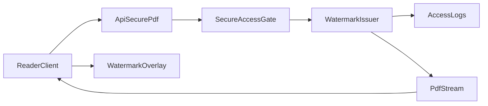

# P2 Watermark Trace Design

Ngay cap nhat: 2026-03-24
Trang thai: Design approved candidate (chua code)

## 1) Muc tieu

Thay watermark "email tinh" bang watermark co kha nang truy vet:

- Khong lo PII truc tiep tren man hinh.
- Co token ngan gon de trich xuat tu anh/chup man hinh.
- Co mapping token -> user/session/request/document trong log.

## 2) Contract watermark token

## 2.1 Dinh dang hien thi

De xuat string hien thi:

- `D2S:{wm_short}`
- `wm_short`: 8 ky tu base32 (vd `A7K9M2QX`)

Phan hien thi bo sung (nho, lap lai):

- `DOC:{doc_short}`
- `T:{issued_bucket}`

## 2.2 Dinh dang server-side (metadata)

De xuat metadata ghi trong `access_logs.metadata`:

- `wm_id`: chuoi dinh danh dai (uuid hoac 128-bit random encoded)
- `wm_short`: token ngan hien thi cho nguoi dung/noi bo
- `wm_issued_at_bucket`: bucket theo phut (ISO minute)
- `wm_version`: `v1`
- `wm_doc_short`: 6-8 ky tu hash rut gon cua document id

## 2.3 Cach sinh token

1. Khi secure access gate pass (truoc khi stream pdf), tao:
   - `wm_id = random 128-bit`
   - `wm_short = base32(wm_id).slice(0,8)`
   - `wm_issued_at_bucket = floor(now to minute)`
2. Ghi metadata vao `access_logs` (status `success`) cung request.
3. Tra thong tin watermark ve client (chi `wm_short`, `wm_doc_short`, `wm_issued_at_bucket`).

Luu y:
- Khong dua `user_id` vao watermark text.
- Mapping forensic duoc tim tu logs bang `wm_short` + bucket + doc.

## 3) Watermark rendering strategy

Phan lien quan file:

- `src/features/documents/read/components/PdfCanvasRenderer.tsx`
- `src/features/documents/read/components/SecureReader.tsx`
- `src/features/documents/read/hooks/usePdfFetchAndDecode.ts`

De xuat rendering:

1. Luoi watermark 9-12 diem nhu hien tai, nhung:
   - offset nhe theo `wm_short` (deterministic pseudo-random)
   - rotate 2-3 goc khac nhau
2. Hien thi ket hop:
   - dong 1: `D2S:{wm_short}`
   - dong 2: `DOC:{wm_doc_short} T:{wm_issued_at_bucket_mm}`
3. Adaptive contrast:
   - neu nen sang -> text toi + opacity 0.20-0.28
   - neu nen toi -> text sang + opacity 0.18-0.24

Muc tieu:
- Kho crop het watermark.
- Van doc duoc noi dung PDF.

## 4) Server-client data flow (de xuat)

## 5) Forensic lookup workflow

Input:
- anh leak/chup man hinh co token (vd `D2S:A7K9M2QX`)

Buoc tra nguoc:
1. Trich `wm_short` tu artifact.
2. Khoanh khung thoi gian leak (manual estimate).
3. Query `access_logs` theo:
   - `metadata->>wm_short = token`
   - `document_id` neu biet
   - window thoi gian phu hop
4. Xac nhan `user_id`, `device_id`, `ip_address`, `correlation_id`.
5. Lap incident record.

## 6) Yeu cau schema/logging toi thieu cho phase code

1. Mo rong `logSecurePdfAccess` (`src/lib/access-log.ts`) de nhan optional:
   - `watermark?: { wmId, wmShort, wmIssuedAtBucket, wmDocShort, wmVersion }`
2. Mo rong secure access context (`run-next-secure-document-access.ts`) de mang watermark payload.
3. Mo rong response contract cho reader (neu can endpoint trung gian):
   - Reader can nhan duoc `wm_short`, `wm_doc_short`, `wm_issued_at_bucket`.

## 7) Non-goals (P2 design)

- Khong giai quyet watermark burn-in server-side ngay trong P2 design.
- Khong thay doi DRM runtime trong phase nay.
