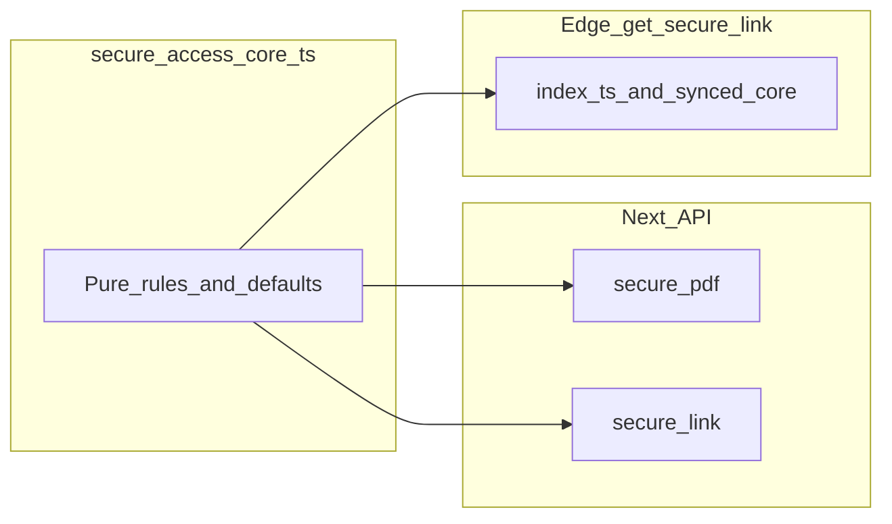
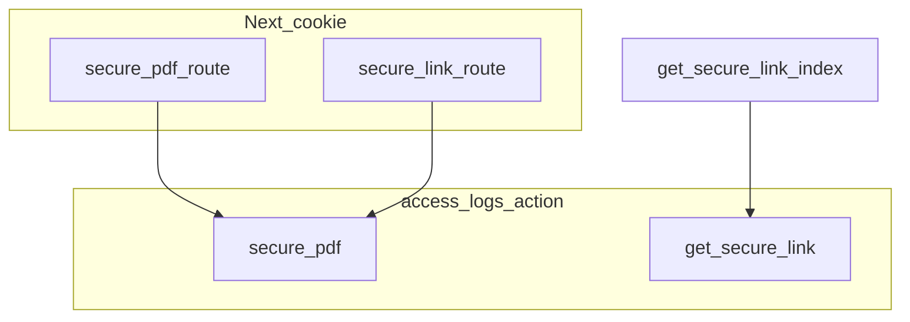
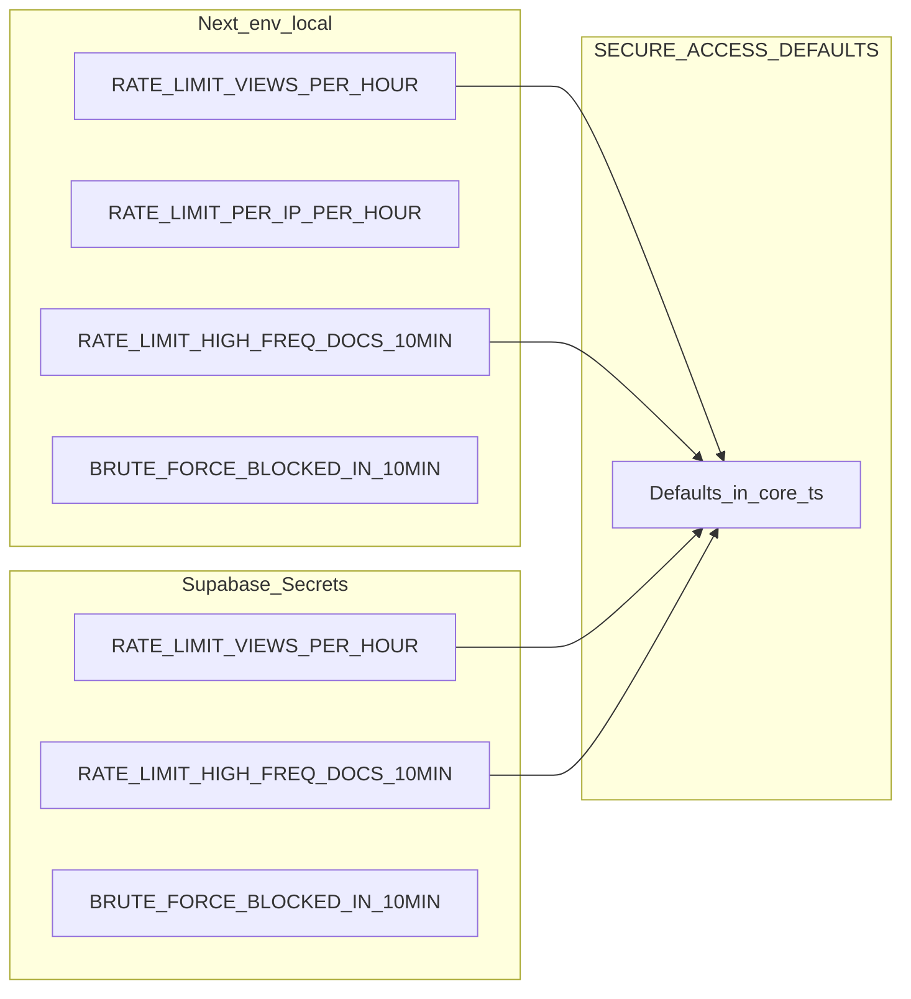
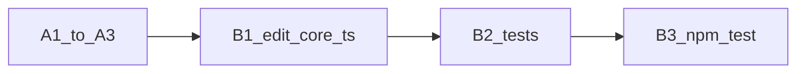
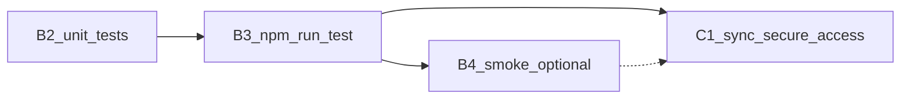
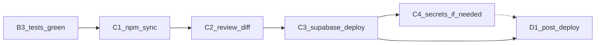
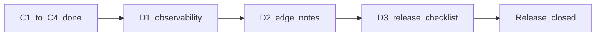

# Đồng bộ Secure Access (Next API + Edge)

Tài liệu mô tả **một nguồn sự thật** cho quy tắc đọc tài liệu (thiết bị, phiên, quyền, ngưỡng rate), **kỷ luật đồng bộ** giống SePay, và cách vận hành khi thay đổi logic.

---

## 1. Bối cảnh

Ứng dụng có nhiều điểm vào để cấp quyền xem file trong Storage (`private_documents`):

| Entrypoint | Auth | Ghi chú |
|------------|------|---------|
| `POST /api/secure-pdf` | Cookie (Supabase session) | **Secure Reader** trong web — stream PDF. |
| `POST /api/secure-link` | Cookie | Trả JSON `{ url }` (signed URL ngắn hạn). Cùng quy tắc nghiệp vụ và cùng audit/rate limit với `secure-pdf` (action `secure_pdf` trong `access_logs`). |
| Edge `get-secure-link` | `Authorization: Bearer <JWT>` | Client ngoài web (mobile, tích hợp). Có thể tạo/cập nhật `active_sessions` khi thiếu; ghi `access_logs` với action **`get_secure_link`**. |

Logic **thuần** (không gọi Supabase) nằm tại:

[`src/lib/secure-access/secure-access-core.ts`](../src/lib/secure-access/secure-access-core.ts)

---

## 2. Quy trình đồng bộ (giống SePay)

1. Sửa **chỉ** file nguồn: `src/lib/secure-access/secure-access-core.ts`.
2. Chạy unit test: `npm run test` (bao gồm `secure-access-core.test.ts`).
3. Đồng bộ sang Edge:  
   `npm run sync:secure-access`  
   (script: [`scripts/sync-secure-access-core.mjs`](../scripts/sync-secure-access-core.mjs) → ghi `supabase/functions/get-secure-link/secure-access-core.ts`).
4. Kiểm tra diff; deploy:  
   `supabase functions deploy get-secure-link`

Sau bước sync, **không** chỉnh tay file `supabase/functions/get-secure-link/secure-access-core.ts` (file có header AUTO-GENERATED).

---

## 3. Nội dung trong `secure-access-core`

- Hằng số mặc định: `SECURE_ACCESS_DEFAULTS` (ví dụ `SIGNED_URL_EXPIRY_SECONDS`, `MAX_DEVICES_PER_USER`, ngưỡng rate mặc định).
- Hàm thuần: `isProfileActive`, `computeIsSuperAdmin`, `computeIsAdminCanReadAny`, `evaluateDeviceGate`, `evaluateSessionDevice`, `evaluateDocumentPermission`, `wouldExceedHourlySuccessLimit`, `wouldExceedHighFreqDistinctDocs`, `parsePositiveIntEnv`.

Route handlers (Next/Edge) chỉ lo **I/O** (query Supabase, ghi log, HTTP status) và truyền dữ liệu vào các hàm trên.

---

## 4. `access_logs` và observability

| Action | Nguồn |
|--------|--------|
| `secure_pdf` | `POST /api/secure-pdf` và `POST /api/secure-link` (cùng bucket rate limit theo user cho hai route Next). |
| `get_secure_link` | Edge `get-secure-link`. |

Khi đọc dashboard / Observability, cần biết cả hai action nếu muốn tổng lượt “xem tài liệu” cho mọi client. Chi tiết: [RUNBOOK.md](../RUNBOOK.md) mục 7.3.

---

## 5. Biến môi trường (Next)

Trong `.env.local` (ứng dụng Next), có thể tùy chỉnh (xem route `secure-pdf` / `secure-link`):

- `RATE_LIMIT_VIEWS_PER_HOUR`
- `RATE_LIMIT_PER_IP_PER_HOUR`
- `RATE_LIMIT_HIGH_FREQ_DOCS_10MIN`
- `BRUTE_FORCE_BLOCKED_IN_10MIN`

Giá trị mặc định khi thiếu: đối với hầu hết biến trên, lấy từ `SECURE_ACCESS_DEFAULTS` trong core (qua `parsePositiveIntEnv`). Riêng **`RATE_LIMIT_PER_IP_PER_HOUR`**: khi không set, code Next dùng **40** (không nằm trong `SECURE_ACCESS_DEFAULTS`).

---

## 6. Biến môi trường (Edge, tùy chọn)

Trên Supabase → Edge Functions → Secrets, có thể đặt cùng **tên** để đồng bộ ngưỡng với app:

- `RATE_LIMIT_VIEWS_PER_HOUR`
- `RATE_LIMIT_HIGH_FREQ_DOCS_10MIN`
- `BRUTE_FORCE_BLOCKED_IN_10MIN`

Nếu không set, Edge dùng fallback từ `SECURE_ACCESS_DEFAULTS` trong file core đã sync.

Edge **không** đọc `RATE_LIMIT_PER_IP_PER_HOUR` (giới hạn theo IP chỉ áp dụng trên route Next).

---

## 7. Khác biệt có chủ đích (Edge)

- **Phiên**: Edge có thể **tạo** bản ghi `active_sessions` khi chưa có (client chỉ gửi JWT, không qua flow cookie như web). Next **không** tự tạo phiên trong các route này — user cần đã qua Tủ sách / đăng ký phiên (xem code Edge `index.ts`).
- **usage_stats**: Chỉ Edge (sau khi cấp link thành công) bump `usage_stats` như trước.
- Next dùng helper chung [`run-next-secure-document-access.ts`](../src/lib/secure-access/run-next-secure-document-access.ts) cho hai route web (`/api/secure-pdf`, `/api/secure-link`) để tránh lệch logic nội bộ.

### 7.2 Shared Database Helpers (`secure-access-db-helpers.ts`)

Bổ sung từ Round 4 để giảm lặp lại code I/O (ghi log, kiểm tra thiết bị) giữa Next và Edge:
- File nguồn: `src/lib/secure-access/secure-access-db-helpers.ts`.
- File sync: `supabase/functions/get-secure-link/secure-access-db-helpers.ts`.
- Lệnh: `npm run sync:secure-access-db`.
- Các hàm: `persistDeviceLogRowShared`, `logAccessShared`, `insertSecurityLogShared`, `logObservabilityShared`.

### 7.3 High-Value Doc Semantics (Round 4 Update)

- **`is_high_value = true`**: Ép buộc chế độ **SSW** (Server-Side Watermarking). API `secure-pdf` trả về **403** kèm metadata để client chuyển sang `SecureImageRenderer`.
- **`is_high_value = false`**: Cho phép tải/xem PDF gốc (vector). API `secure-pdf` trả về stream PDF trực tiếp (mã **200**).
- **Download**: Nút tải về trong `SecureReader` hiện dựa trên cờ `is_downloadable`. Nếu là High-Value doc, nút này có thể hiện nhưng sẽ không có blob PDF để tải (trừ khi có endpoint tải watermarked PDF riêng).

### 7.4 Đối chiếu Next vs Edge (tránh drift)

| Khía cạnh | Next (`secure-pdf` / `secure-link`) | Edge (`get-secure-link`) |
|-----------|-------------------------------------|---------------------------|
| Auth | Cookie session | Bearer JWT |
| `access_logs.action` | `secure_pdf` (cả hai route) | `get_secure_link` |
| Phiên `active_sessions` | Bắt buộc khớp thiết bị (`evaluateSessionDevice`); không tự tạo trong route | Có thể insert/cập nhật phiên + cập nhật `device_id` khi lệch |
| Rate limit IP | Có (`RATE_LIMIT_PER_IP_PER_HOUR`) | Không |
| Brute-force blocked | Đếm `action = secure_pdf`, `status = blocked` | Logic riêng theo action `get_secure_link` |
| Sau cấp quyền | PDF stream hoặc signed URL | Signed URL + `usage_stats` + observability |
| High-Value Support| Có (Respect DB flag, toggle 200/403) | Không (Dùng `secure-pdf` để xem) |

Checklist khi sửa helper Next:

1. Đã xác nhận thay đổi thuộc **core dùng chung** hay chỉ Next I/O?
2. Nếu là core dùng chung: sửa [`secure-access-core.ts`](../src/lib/secure-access/secure-access-core.ts) hoặc [`secure-access-db-helpers.ts`](../src/lib/secure-access/secure-access-db-helpers.ts), chạy test, rồi chạy lệnh sync tương ứng.
3. Đã đối chiếu bảng trên để quyết định có cần cập nhật [`supabase/functions/get-secure-link/index.ts`](../supabase/functions/get-secure-link/index.ts) không?

---

## 8. Checklist release

Xem [RELEASE-CHECKLIST.md](./RELEASE-CHECKLIST.md) mục **Secure access**.

---

## 9. Kế hoạch thực thi

Kế hoạch dưới đây áp dụng khi **thay đổi quy tắc đọc tài liệu** (thiết bị, phiên, quyền, rate) hoặc khi **onboard** người mới làm việc với luồng Secure Access. Thứ tự giữ đúng “một nguồn sự thật” + đồng bộ Edge như mục 2.

### 9.1 Chuẩn bị

| Bước | Việc cần làm | Ghi chú |
|------|----------------|--------|
| A1 | Xác định phạm vi thay đổi | Chỉ sửa business logic trong [`secure-access-core.ts`](../src/lib/secure-access/secure-access-core.ts); route Next/Edge chỉ I/O. |
| A2 | Rà soát entrypoint | Web: `POST /api/secure-pdf`, `POST /api/secure-link`; Edge: `get-secure-link` (Bearer JWT). Đảm bảo `access_logs` (`secure_pdf` vs `get_secure_link`) vẫn phản ánh đúng nguồn (mục 4). |
| A3 | Biến môi trường | Liệt kê thay đổi cần cho Next (mục 5) và Edge Secrets (mục 6); ghi vào ticket/release note. |

#### 9.1.1 Chi tiết bước A1 — Xác định phạm vi thay đổi

**Mục tiêu.** Trước khi sửa code, có một mô tả phạm vi (ticket / ghi chú release) trả lời được: thay đổi là **quy tắc dùng chung** hay **một entrypoint**; file nào **được phép** sửa; có cần **mở rộng type/tham số** trong core không.

**1) Ghi yêu cầu và phân loại**

- Viết **một câu** nêu hành vi mong muốn (thiết bị, phiên, quyền tài liệu, rate, v.v.).
- **Cùng quy tắc** cho web (`/api/secure-pdf`, `/api/secure-link`) và Bearer (`get-secure-link`) → mặc định đặt logic trong [`secure-access-core.ts`](../src/lib/secure-access/secure-access-core.ts); handler chỉ query Supabase, parse env, truyền tham số vào hàm core.
- **Chỉ một entrypoint** (ví dụ chỉ Edge tạo/cập nhật `active_sessions`, chỉ Edge bump `usage_stats`) → **không** đưa vào core; phạm vi ghi rõ file handler: [`supabase/functions/get-secure-link/index.ts`](../supabase/functions/get-secure-link/index.ts) hoặc route Next tương ứng.

**2) Ranh giới core vs handler**

| Thuộc **core** | Thuộc **handler** (I/O) |
|----------------|-------------------------|
| `SECURE_ACCESS_DEFAULTS`; điều kiện profile / thiết bị / phiên / quyền; toán rate | Supabase, cookie/JWT, HTTP, `access_logs`, signed URL, tạo/cập nhật `active_sessions`, `usage_stats` |

Core **không** import Supabase. Không sửa trực tiếp [`supabase/functions/get-secure-link/secure-access-core.ts`](../supabase/functions/get-secure-link/secure-access-core.ts) (AUTO-GENERATED); mọi thay đổi quy tắc từ nguồn `src/lib/secure-access/secure-access-core.ts` rồi `npm run sync:secure-access`.



**3) Ánh xạ nhanh sang hàm và type trong core**

Dùng bảng dưới để ghi vào ticket hàm/type nào sẽ đổi hoặc cần bổ sung (kèm cập nhật [`secure-access-core.test.ts`](../src/lib/secure-access/secure-access-core.test.ts) ở bước B2).

| Chủ đề | Hàm / artifact trong core |
|--------|---------------------------|
| Profile còn hoạt động | `isProfileActive`, type `SecureAccessProfile` |
| Quyền admin đọc mọi tài liệu / super admin | `computeIsSuperAdmin`, `computeIsAdminCanReadAny` |
| Giới hạn số thiết bị | `evaluateDeviceGate`, `DeviceGateResult` |
| Phiên gắn thiết bị | `evaluateSessionDevice`, `SessionGateResult` |
| Quyền theo tài liệu / hết hạn | `evaluateDocumentPermission`, `PermissionGateResult` |
| Rate theo giờ / high-freq nhiều tài liệu | `wouldExceedHourlySuccessLimit`, `wouldExceedHighFreqDistinctDocs` |
| Ngưỡng mặc định / parse env | `SECURE_ACCESS_DEFAULTS`, `parsePositiveIntEnv` |

Nếu thêm nhánh `reason` mới hoặc đổi semantics type → ghi rõ trong phạm vi để tránh lệch Next và Edge sau sync.

**4) Mặc định vs biến môi trường (chuẩn bị A3)**

- Đổi **giá trị mặc định cố định** trong code → cân nhắc `SECURE_ACCESS_DEFAULTS` trong core (đồng bộ sang Edge khi sync).
- Cần **cấu hình theo môi trường** (prod/staging) → dùng biến đã có ở mục 5 (Next) và mục 6 (Edge Secrets), parse trong route bằng `parsePositiveIntEnv(..., SECURE_ACCESS_DEFAULTS....)`.
- Ghi vào ticket: tên biến mới (nếu có), giá trị mặc định, và có cần cập nhật tài liệu mục 5–6 không.

**5) Template đoạn phạm vi trong ticket (sao chép điền)**

```text
Phạm vi core (secure-access-core.ts): …
Phạm vi handler Next (secure-pdf / secure-link): …
Phạm vi Edge ngoài file generated (get-secure-link/index.ts): …
Không đụng: …
Types/reason mới: …
access_logs / quan sát: (có đổi action hay chỉ đếm sau không?) …
Env / Secrets: …
```

**6) Lỗi thường gặp**

- Đặt quy tắc (admin, rate) chỉ trong **một** route trong khi route kia hoặc Edge vẫn gọi core → lệch hành vi web vs mobile.
- Sửa file generated Edge thay vì nguồn trong `src/` rồi sync.

Sau khi khóa phạm vi A1, chuyển sang bước **A2** (mục 9.1.2).

#### 9.1.2 Chi tiết bước A2 — Rà soát entrypoint và `access_logs`

**Mục tiêu.** Ticket hoặc ghi chú release ghi rõ: mỗi điểm vào gọi **hàm core** nào và theo **thứ tự** nào (khớp A1); chuỗi **`action`** trong `access_logs` vẫn **đúng nguồn** (mục 4); mọi truy vấn rate/đếm dùng **cùng** `action` với nơi ghi log.

**Điểm neo trong repo**

| Entrypoint | File | Action trong `access_logs` |
|------------|------|----------------------------|
| `POST /api/secure-pdf` | [`src/app/api/secure-pdf/route.ts`](../src/app/api/secure-pdf/route.ts) | `ACTION_SECURE_PDF` → `"secure_pdf"` từ [`src/lib/access-log.ts`](../src/lib/access-log.ts) |
| `POST /api/secure-link` | [`src/app/api/secure-link/route.ts`](../src/app/api/secure-link/route.ts) | Cùng `secure_pdf` (cùng bucket rate theo user, cùng helper log) |
| Edge `get-secure-link` | [`supabase/functions/get-secure-link/index.ts`](../supabase/functions/get-secure-link/index.ts) | `"get_secure_link"` trong `logAccess` / insert `access_logs` |



**1) Đối chiếu A1**

- Mở phạm vi đã khóa ở A1: thay đổi đụng **chỉ core**, **chỉ Next**, **chỉ Edge**, hay kết hợp? Liệt kê file handler dự kiến sửa.

**2) Hai route Next — so sánh cặp**

- Đọc song song [`secure-pdf/route.ts`](../src/app/api/secure-pdf/route.ts) và [`secure-link/route.ts`](../src/app/api/secure-link/route.ts): cùng import từ `secure-access-core`, cùng `logSecurePdfAccess` / `ACTION_SECURE_PDF`.
- Mọi chỗ `.eq("action", ...)` khi đếm hoặc giới hạn theo giờ phải dùng **`ACTION_SECURE_PDF`** (không để một route dùng chuỗi thủ công lệch).
- Nếu release thêm nhánh lỗi/thành công: xác nhận **cả hai** route vẫn ghi log qua cùng abstraction ([`access-log`](../src/lib/access-log.ts)) hoặc cùng constant.

**3) Edge `get-secure-link`**

- Rà [`index.ts`](../supabase/functions/get-secure-link/index.ts): mọi `logAccess` / insert liên quan rate dùng **`"get_secure_link"`** (không lẫn `secure_pdf`).
- Khác biệt có chủ đích (mục 7): tạo/cập nhật `active_sessions`, bump `usage_stats` — không thuộc core; khi sửa I/O, kiểm tra không đổi nhầm semantics log.

**4) Observability**

- Nếu thay đổi làm đổi ý nghĩa “một lượt xem” hoặc tách bucket: ghi chú cho dashboard — tổng “xem tài liệu” thường cần gộp `secure_pdf` và `get_secure_link` ([RUNBOOK.md](../RUNBOOK.md) §7.3, mục 4).

**5) Đầu ra ticket (A2)**

Ghi ngắn, ví dụ: *Đã rà 3 entrypoint; action không đổi / cần đổi chỗ … vì …; route Next/Edge nào cần chỉnh song song; có tác động query dashboard không.*

**6) Lỗi thường gặp**

- Sửa một trong hai route Next mà quên route kia → lệch rate hoặc audit.
- Copy-paste query giữa Next và Edge mà nhầm `action`.
- Đổi tên `action` trong DB mà không cập nhật dashboard/query hiện có.

Sau khi hoàn tất A2, chuyển sang bước **A3** (mục 9.1.3).

#### 9.1.3 Chi tiết bước A3 — Biến môi trường (Next + Edge Secrets)

**Mục tiêu.** Ticket hoặc ghi chú release nêu rõ: biến nào đổi; giá trị theo môi trường và fallback; Next và Edge có cần **cùng tên / cùng ngưỡng** cho từng loại rate hay không.

**1) Kế thừa A1**

- Release chỉ đổi `SECURE_ACCESS_DEFAULTS` trong core và **không** cần override theo môi trường → có thể ghi *“A3: không đổi env; đủ sau sync/deploy core”*.
- Cần khác nhau giữa local / staging / prod → liệt kê từng biến và giá trị dự kiến.

**2) Bảng đối chiếu Next vs Edge**

| Biến | Next (`secure-pdf` / `secure-link`) | Edge (`get-secure-link`) | Ghi chú |
|------|--------------------------------------|--------------------------|---------|
| `RATE_LIMIT_VIEWS_PER_HOUR` | `process.env` | `Deno.env` | Cùng tên; fallback `SECURE_ACCESS_DEFAULTS.RATE_LIMIT_VIEWS_PER_HOUR` |
| `RATE_LIMIT_HIGH_FREQ_DOCS_10MIN` | Có | Có | Trong code map sang `HIGH_FREQ_DOCS_IN_10MIN`; fallback `SECURE_ACCESS_DEFAULTS.HIGH_FREQ_DOCS_IN_10MIN` |
| `BRUTE_FORCE_BLOCKED_IN_10MIN` | Có | Có | Fallback `SECURE_ACCESS_DEFAULTS.BRUTE_FORCE_BLOCKED_IN_10MIN` |
| `RATE_LIMIT_PER_IP_PER_HOUR` | Có | **Không** | Next: fallback **40** khi thiếu; không có trên Edge |

Chi tiết định nghĩa biến: **mục 5** (Next) và **mục 6** (Edge) trong file này.



**3) Next — `.env.local` / biến hosting**

Đặt hoặc cập nhật các key mà [`secure-pdf`](../src/app/api/secure-pdf/route.ts) và [`secure-link`](../src/app/api/secure-link/route.ts) đọc. Xác nhận **cả hai** route dùng cùng block parse env.

**4) Edge — Supabase → Edge Functions → Secrets**

Chỉ các biến Edge thực sự đọc (ba biến trong mục 6). Sau khi đổi Secrets, làm theo quy trình team (deploy lại function nếu cần).

**5) Đồng bộ ngưỡng**

Khi chỉnh một ngưỡng dùng chung (ví dụ lượt xem/giờ), cập nhật **song song** env Next và Secret Edge **cùng tên** để tránh lệch web và client Bearer.

**6) Cập nhật tài liệu (khi cần)**

Nếu thêm biến mới hoặc đổi semantics: cập nhật mục 5–6 trong file này và/hoặc [RELEASE-CHECKLIST.md](./RELEASE-CHECKLIST.md) mục **Secure access**.

**7) Đầu ra ticket (A3)**

Bảng ngắn (sao chép điền):

```text
Biến | Next (Y/N) | Edge (Y/N) | Giá trị / ghi chú (default nếu không set)
…    | …          | …          | …
```

**8) Lỗi thường gặp**

- Chỉ sửa Next env mà quên Edge (hoặc ngược lại) khi hai bên cùng áp dụng một ngưỡng nghiệp vụ.
- Nhầm tên biến so với `process.env` / `Deno.env.get`.
- Kỳ vọng Edge có rate limit theo IP — Edge **không** đọc `RATE_LIMIT_PER_IP_PER_HOUR`.

Sau khi hoàn tất A3, chuyển **B1** (mục 9.2.1) theo bảng bên dưới.

### 9.2 Phát triển và kiểm thử cục bộ

| Bước | Việc cần làm | Lệnh / artifact |
|------|----------------|------------------|
| B1 | Sửa **chỉ** `src/lib/secure-access/secure-access-core.ts` | — |
| B2 | Cập nhật / bổ sung unit test nếu logic mới cần | `secure-access-core.test.ts` |
| B3 | Chạy toàn bộ test | `npm run test` |
| B4 | (Tùy chọn) Chạy app Next và smoke test route `secure-pdf` / `secure-link` với cookie session | Thủ công hoặc E2E nếu dự án có |

#### 9.2.1 Chi tiết bước B1 — Sửa nguồn `secure-access-core.ts`

**Vị trí.** B1 nằm sau A1–A3; tiếp theo là **B2** (unit test) và **B3** (`npm run test`).



**Mục tiêu.** Đưa mọi thay đổi **quy tắc nghiệp vụ thuần** (thiết bị, phiên, quyền tài liệu, toán rate, `SECURE_ACCESS_DEFAULTS`, `parsePositiveIntEnv`) vào **một file nguồn**: [`src/lib/secure-access/secure-access-core.ts`](../src/lib/secure-access/secure-access-core.ts). **Không** thêm I/O (Supabase, HTTP, cookie, JWT) trong bước này.

**Khi nào không cần B1 (hoặc B1 rỗng)**

- Release chỉ đổi biến môi trường / Secrets (A3) mà **không** đổi default trong code → có thể bỏ qua sửa core.
- Release chỉ đổi handler (log, HTTP, Edge `active_sessions`) mà **không** đổi quy tắc thuần → không sửa `secure-access-core.ts` trong B1.

**1) Đối chiếu ticket A1**

- Chỉ implement đúng phần *Phạm vi core* đã khóa; không mở rộng ngoài phạm vi.
- Nếu A1 yêu cầu chỉnh thêm [`secure-pdf`](../src/app/api/secure-pdf/route.ts) / [`secure-link`](../src/app/api/secure-link/route.ts) hoặc [`get-secure-link/index.ts`](../supabase/functions/get-secure-link/index.ts), lên kế hoạch **sau B1** (handler tách bước hoặc commit cùng release): B1 xong **core** trước, rồi chỉnh handler truyền đúng tham số / map `reason`.

**2) Chỉnh `SECURE_ACCESS_DEFAULTS` (nếu có)**

Mọi default mới hoặc đổi giá trị ảnh hưởng Next (fallback env) và Edge (sau sync) — nhất quán với **mục 5–6** trong file này.

**3) Types và union `reason`**

Nếu thêm nhánh kết quả (`DeviceGateResult`, `SessionGateResult`, `PermissionGateResult`, …), cập nhật type trong cùng file; handler sẽ map `reason` → HTTP/message **sau** B1 (không làm trong B1).

**4) Hàm thuần**

Tái sử dụng / mở rộng các hàm ở **mục 3**; tránh trùng lặp logic.

**5) Giới hạn file**

Chỉ sửa [`secure-access-core.ts`](../src/lib/secure-access/secure-access-core.ts). **Không** sửa [`supabase/functions/get-secure-link/secure-access-core.ts`](../supabase/functions/get-secure-link/secure-access-core.ts) (AUTO-GENERATED); bước sync là **C1** sau B2/B3.

**6) Chuyển B2 (mục 9.2.2)**

Mọi nhánh logic mới hoặc default đổi → bổ sung / cập nhật [`secure-access-core.test.ts`](../src/lib/secure-access/secure-access-core.test.ts) ngay sau B1.

**Lỗi thường gặp**

- Sửa nhầm file generated Edge thay vì nguồn trong `src/`.
- Nhét Supabase hoặc `process.env` vào core.
- Đổi quy tắc chỉ trong một route trong khi A1 đã xác định quy tắc **dùng chung** — phải nằm trong core.

Sau khi hoàn tất B1, chuyển **B2** (mục 9.2.2), rồi **B3** theo bảng trên; khi test xanh, chuyển **C1** (`npm run sync:secure-access`) theo **mục 2**.

#### 9.2.2 Chi tiết bước B2 — Unit test `secure-access-core`

**Vị trí.** B2 đứng ngay sau B1, trước B3 (`npm run test`) và C1 (`npm run sync:secure-access`). Mục đích: mọi quy tắc mới hoặc đổi hành vi trong [`secure-access-core.ts`](../src/lib/secure-access/secure-access-core.ts) đều có **ít nhất một assertion** phản ánh đúng.

**Phạm vi**

| Làm trong B2 | Không làm trong B2 |
|--------------|-------------------|
| Sửa / thêm test trong [`secure-access-core.test.ts`](../src/lib/secure-access/secure-access-core.test.ts) | Test route Next, Edge, hoặc Supabase (B4 / E2E tách) |

Framework: `node:test` + `node:assert` (import từ `secure-access-core.ts` cùng thư mục). Lệnh suite: `npm run test` (script [`scripts/run-unit-tests.mjs`](../scripts/run-unit-tests.mjs)). Hướng dẫn thêm: [TESTING.md](../TESTING.md).

**Khi nào B2 tối thiểu**

- **Không có B1** (chỉ env/handler) → thường **không** cần đổi `secure-access-core.test.ts`; vẫn chạy B3 để xác nhận suite xanh.
- **B1 chỉ refactor** không đổi hành vi → có thể chỉ chạy B3; nếu team yêu cầu, thêm test “smoke” cho hàm đụng tới.

**1) Đối chiếu diff B1**

Liệt kê hàm, type, nhánh `reason`, hoặc `SECURE_ACCESS_DEFAULTS` đã đổi; mỗi mục có test tương ứng hoặc cập nhật assertion.

**2) Mục tiêu kiểm thử (theo loại thay đổi B1)**

- Hàm mới hoặc `reason` mới — thêm `test("...")` cho từng `ok: true/false` và `reason` (nếu có).
- Đổi `SECURE_ACCESS_DEFAULTS` hoặc logic biên — sửa test cũ hoặc thêm case biên (vừa đủ / vượt).
- `parsePositiveIntEnv` — giữ / mở rộng case: chuỗi hợp lệ, `undefined`, không phải số, giá trị `>= 1`.
- **Regression** — không xóa test bảo vệ hành vi cũ trừ khi B1 cố ý đổi contract (ghi trong ticket).

**3) Import và tên test**

Nếu B1 export thêm symbol, cập nhật `import { ... }` đầu file test. Đặt tên `test("evaluateX … scenario", …)` ngắn gọn, mô tả kỳ vọng.

**4) Chuyển B3 (mục 9.2.3)**

Xem mục 9.2.3 — chạy `npm run test` toàn repo; sửa đến khi pass trước C1.

**Lỗi thường gặp**

- Chỉ test happy path mà bỏ nhánh từ chối (`reason`).
- Phụ thuộc thời gian thực — nếu core so sánh thời gian, dùng chuỗi ngày **cố định** trong test (xem pattern `expires_at` hiện có).
- Gộp test integration vào file này — giữ **thuần unit** cho core.

Sau khi hoàn tất B2, chuyển **B3** (mục 9.2.3), rồi **B4** (tùy chọn, cùng mục); khi B3 xanh, chuyển **C1** (mục 9.3.1) theo **mục 2** và **§9.3**.

#### 9.2.3 Chi tiết bước B3 và B4 — Suite unit và smoke Next

**Vị trí.** B3 và B4 nằm trong bảng **§9.2** phía trên, sau B2, trước C1. **B3 bắt buộc** trước khi sync core sang Edge; **B4 tùy chọn** nhưng nên làm khi đổi handler hoặc hành vi end-to-end.



##### B3 — Chạy toàn bộ test

**Lệnh:** `npm run test` — script [`scripts/run-unit-tests.mjs`](../scripts/run-unit-tests.mjs): tìm mọi `**/*.test.ts` dưới `src/`, **loại trừ** `src/test-integration`, chạy `node --experimental-strip-types --test` (Node 22+ theo ghi chú script).

**Mục tiêu**

- Xác nhận **toàn bộ** suite unit (không chỉ `secure-access-core`) vẫn pass sau thay đổi B1/B2 hoặc chỉnh handler trong cùng release.
- Coi B3 là **cổng** trước `npm run sync:secure-access` (C1): không pass B3 thì không sync/deploy core Edge theo **mục 2**.

**Quy trình**

1. Chạy `npm run test` từ thư mục gốc repo.
2. Nếu fail: sửa test nếu expectation lỗi thời, hoặc sửa mã nếu regression thật.
3. Nếu CI chạy cùng lệnh, đối chiếu kết quả local với pipeline.

**Lỗi thường gặp**

- Chỉ chạy riêng `secure-access-core.test.ts` mà không chạy full suite.
- Fail do phiên bản Node thấp hơn yêu cầu.

Tham chiếu: [TESTING.md](../TESTING.md).

##### B4 — Smoke test Next (tùy chọn)

**Phạm vi:** đăng nhập web (cookie Supabase session), gọi **`POST /api/secure-pdf`** và **`POST /api/secure-link`** như client thật.

**Khi nên làm B4**

- Đổi [`secure-pdf/route.ts`](../src/app/api/secure-pdf/route.ts) hoặc [`secure-link/route.ts`](../src/app/api/secure-link/route.ts) (I/O, rate, log, body).
- Thay đổi luồng Tủ sách / phiên / thiết bị ảnh hưởng khi đọc PDF hoặc lấy signed URL.
- Release cần chứng minh nhanh **200** vs **4xx** đúng kỳ vọng.

**Gợi ý tối thiểu (thủ công)**

- User hợp lệ, có quyền: `secure-pdf` trả stream/PDF như kỳ vọng; `secure-link` trả JSON có `url` (hoặc cấu trúc hiện tại của app).
- Một case từ chối (nếu dễ tái hiện): mã lỗi / message khớp policy (rate limit, không quyền, v.v.).

**Edge / Bearer (ngoài phạm vi cookie của B4)**

- Nếu release đụng [`get-secure-link`](../supabase/functions/get-secure-link/index.ts), kiểm tra riêng (curl/Postman + JWT); ghi vào ticket.

**E2E / test-integration**

- Nếu có test dưới `src/test-integration` hoặc E2E — dùng theo [TESTING.md](../TESTING.md); **không** thay thế B3.

**Sau B3 / B4**

- **C1** (mục 9.3.1) sau khi B3 xanh. B4 không chặn C1; nếu bỏ qua B4, ghi *“chưa smoke”* trong ticket khi cần minh bạch.

### 9.3 Đồng bộ sang Edge và triển khai

| Bước | Việc cần làm | Lệnh / artifact |
|------|----------------|------------------|
| C1 | Sync core → Edge (AUTO-GENERATED) | `npm run sync:secure-access` → ghi [`supabase/functions/get-secure-link/secure-access-core.ts`](../supabase/functions/get-secure-link/secure-access-core.ts) |
| C2 | Review diff | Đối chiếu thay đổi core với file Edge đã sync; **không** chỉnh tay file generated. |
| C3 | Deploy function | `supabase functions deploy get-secure-link` |
| C4 | Cấu hình Secrets Edge (nếu A3 có thay đổi) | Supabase Dashboard → Edge Functions → Secrets; tên biến khớp mục 6. |

#### 9.3.1 Chi tiết bước C1–C4 — Đồng bộ và deploy Edge

**Vị trí.** Bảng **§9.3** phía trên; **sau B3** (và B4 tùy chọn). Tóm tắt nhanh cũng có ở **mục 2** (quy trình SePay).



**Điều kiện tiên quyết**

- `npm run test` (B3) **pass**.
- Đã sửa [`src/lib/secure-access/secure-access-core.ts`](../src/lib/secure-access/secure-access-core.ts) trong B1 **hoặc** cần tái sinh file Edge cho khớp nguồn (ví dụ sau khi pull). Nếu release **không** đổi core và file Edge đã khớp — có thể bỏ qua C1–C3 (ghi vào ticket).

##### C1 — Sync core → Edge (AUTO-GENERATED)

**Lệnh:** `npm run sync:secure-access` → [`scripts/sync-secure-access-core.mjs`](../scripts/sync-secure-access-core.mjs).

**Hành vi:** Đọc `src/lib/secure-access/secure-access-core.ts`, ghi [`supabase/functions/get-secure-link/secure-access-core.ts`](../supabase/functions/get-secure-link/secure-access-core.ts) kèm header AUTO-GENERATED — **không** chỉnh tay file đích.

**Đầu ra:** commit file Edge cùng PR release (hoặc theo quy trình team).

##### C2 — Review diff

- Xem `git diff` / diff PR: thay đổi mong đợi chủ yếu là `get-secure-link/secure-access-core.ts` phản ánh đúng B1.
- **Không** chỉnh tay nội dung generated; mọi sửa quy tắc quay về **B1** rồi chạy lại C1.
- Nếu có thay đổi [`get-secure-link/index.ts`](../supabase/functions/get-secure-link/index.ts) (I/O), review tách biệt: logic thuần chỉ từ file sync.

##### C3 — Deploy function

**Lệnh:** `supabase functions deploy get-secure-link` (CLI đã đăng nhập, đúng project/ref môi trường).

**Mục tiêu:** Phiên bản Edge trên cloud trùng commit đã review (gồm `secure-access-core.ts` đã sync và mọi thay đổi `index.ts` nếu có). Deploy **cùng cửa sổ release** với merge core để tránh lệch Next vs Edge (xem **§9.5**).

##### C4 — Secrets Edge (nếu A3 có thay đổi)

**Khi nào:** Ticket A3 ghi đổi `RATE_LIMIT_*` / `BRUTE_FORCE_*` trên Supabase Secrets, hoặc lần đầu cấu hình môi trường.

**Việc làm:** Supabase Dashboard → Edge Functions → Secrets — tên biến khớp **mục 6** (và ý nghĩa đồng bộ với **mục 5** cho Next).

**Thứ tự với C3:** Có thể đặt Secrets trước hoặc sau deploy; function đọc `Deno.env` khi chạy. Trước **D1** (mục 9.4.1), Secrets phải đúng giá trị mong muốn.

**Lỗi thường gặp**

- Chạy C1 nhưng quên commit/push file generated → deploy thiếu thay đổi.
- Deploy nhầm project Supabase.
- Đổi Secrets nhưng tên lệch với `Deno.env.get` trong [`index.ts`](../supabase/functions/get-secure-link/index.ts).

**Sau C1–C4**

Chuyển **§9.4** (D1–D3, chi tiết **mục 9.4.1**): observability, nhắc khác biệt Edge, [RELEASE-CHECKLIST.md](./RELEASE-CHECKLIST.md).

### 9.4 Sau triển khai

| Bước | Việc cần làm | Ghi chú |
|------|----------------|--------|
| D1 | Xác minh observability | Dashboard / log: tổng “xem tài liệu” cần gộp cả `secure_pdf` và `get_secure_link` (mục 4, [RUNBOOK.md](../RUNBOOK.md) §7.3). |
| D2 | Nhắc khác biệt Edge | Phiên: Edge có thể tạo `active_sessions` khi thiếu; `usage_stats` chỉ bump ở Edge sau cấp link thành công (mục 7). |
| D3 | Hoàn tất checklist release | [RELEASE-CHECKLIST.md](./RELEASE-CHECKLIST.md) mục **Secure access** (mục 8). |

#### 9.4.1 Chi tiết bước D1–D3 — Sau triển khai

**Vị trí.** Bảng **§9.4** phía trên; **sau C1–C4**. Không sửa mã nguồn — xác nhận vận hành và đóng release.



##### D1 — Xác minh observability

**Bối cảnh:** `access_logs` có hai `action` khác nguồn — **mục 4** và [RUNBOOK.md](../RUNBOOK.md) §7.3:

- `secure_pdf`: `POST /api/secure-pdf` và `POST /api/secure-link` (Next, cookie).
- `get_secure_link`: Edge `get-secure-link` (Bearer).

**Việc cần làm**

1. Đối chiếu dashboard / query: tổng “xem tài liệu” toàn client có gộp **cả hai** action khi cần; nếu chỉ lọc một action, ghi rõ ý nghĩa (chỉ web hoặc chỉ mobile/integration).
2. Sau deploy: xác nhận có bản ghi mới đúng `action` khi thử một luồng Next và một luồng Edge.
3. Preset / báo cáo admin: nếu có preset “secure”, kiểm tra gồm một hay cả hai action — khớp RUNBOOK §7.3.

**Đầu ra ticket:** Ghi ngắn đã xác nhận metric/query hoặc mục cần chỉnh sau.

##### D2 — Nhắc khác biệt Edge (có chủ đích)

Theo **mục 7** — không phải bug:

- **`active_sessions`**: Edge có thể tạo/cập nhật khi thiếu; Next không tự tạo phiên trong các route secure này — kỳ vọng client Bearer khác web cookie.
- **`usage_stats`**: Chỉ bump ở Edge sau khi cấp link thành công.

Khi hỗ trợ hoặc đọc số liệu sau release, không so sánh trực tiếp luồng web với Edge mà không nhắc hai điểm trên. Cập nhật release note nếu đổi liên quan phiên / `usage_stats`.

##### D3 — Hoàn tất checklist release

Đối chiếu [RELEASE-CHECKLIST.md](./RELEASE-CHECKLIST.md) section **Secure access (đọc tài liệu)** khi có thay đổi logic trong [`src/lib/secure-access/secure-access-core.ts`](../src/lib/secure-access/secure-access-core.ts):

1. `npm run sync:secure-access`
2. Kiểm tra diff Edge function
3. `supabase functions deploy get-secure-link`

Tick hoặc ghi trong ticket đã làm đủ 1–3 trong phạm vi release; nếu không đụng core, ghi *N/A — không đổi core*.

**Ghi chú:** [Mục 8 — Checklist release](./SECURE-ACCESS-SYNC.md#8-checklist-release) trong file này trỏ tới RELEASE-CHECKLIST; không nhầm với đánh số mục trong RUNBOOK.

**Lỗi thường gặp**

- **D1:** Dashboard chỉ đếm `secure_pdf` rồi thiếu lượt từ mobile (Edge).
- **D2:** Coi chênh `usage_stats` web vs Edge là lỗi mà không xem lại thiết kế.
- **D3:** Bỏ qua một trong ba bước Secure access khi đã đổi core.

**Sau D1–D3:** Release Secure Access coi là đóng về tài liệu/vận hành; sự cố sau đó xử lý theo RUNBOOK hoặc quy trình incident.

### 9.5 Rủi ro và lưu ý nhanh

- **Lệch logic Next vs Edge**: Luôn chạy sync sau khi đổi core; deploy Edge cùng release hoặc ngay sau khi merge core để tránh hai nửa không khớp.
- **Chỉnh tay file generated**: Tránh — mọi sửa quay về bước B1.
- **Rate limit / brute-force**: Đổi `SECURE_ACCESS_DEFAULTS` hoặc env; đảm bảo Next và Edge (secrets) cùng ý định vận hành.

---

## 10. Tài liệu liên quan

- [ARCHITECTURE.md](../ARCHITECTURE.md) — §2.5 Luồng truy cập tài liệu  
- [RUNBOOK.md](../RUNBOOK.md) — §7.3 `access_logs`  
- [TESTING.md](../TESTING.md) — unit `secure-access-core.test.ts`
