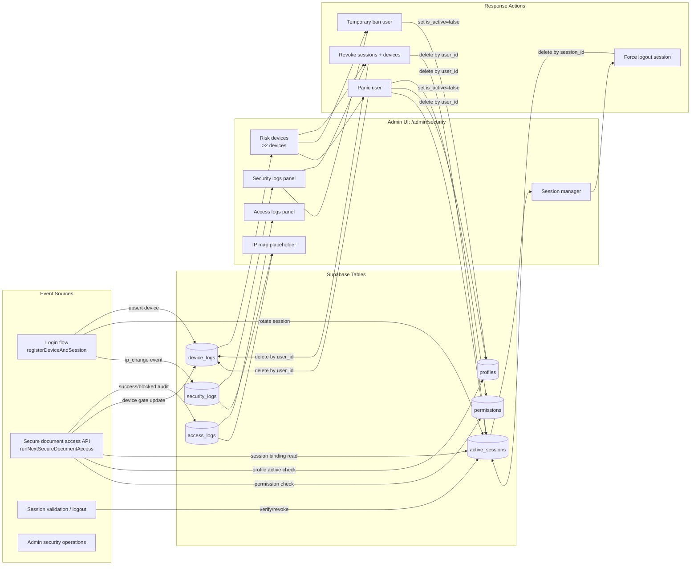

# Admin Security Data Architecture

Tài liệu này mô tả kiến trúc dữ liệu của module `Admin > An ninh` theo luồng:

`Event Sources -> Tables -> Admin UI -> Response Actions`

Mục tiêu: giúp team review nhanh, onboarding nhanh, và có cùng ngôn ngữ khi xử lý sự cố.

## 1) End-to-end flow (Mermaid)

## 2) Data contracts by table

- `device_logs`
  - Dùng cho kiểm soát số thiết bị và phát hiện user nghi vấn.
  - Trường hay dùng: `user_id`, `device_id`, `last_login`.

- `active_sessions`
  - Single-session/session binding để đảm bảo thiết bị hiện tại hợp lệ.
  - Trường hay dùng: `session_id`, `user_id`, `ip_address`, `device_id`, `created_at`.

- `access_logs`
  - Audit truy cập tài liệu secure (`success`/`blocked`) và lý do chặn.
  - Trường hay dùng: `user_id`, `document_id`, `action`, `status`, `ip_address`, `device_id`, `created_at`, `metadata`.

- `security_logs`
  - Nhật ký sự kiện an ninh (ví dụ `ip_change`) theo mức độ `low/medium/high`.
  - Trường hay dùng: `user_id`, `event_type`, `severity`, `ip_address`, `device_id`, `created_at`, `metadata`.

- `profiles`
  - Trạng thái tài khoản để khóa/mở truy cập (`is_active`) và role context.

- `permissions`
  - Quyền đọc tài liệu; bị revoke trong hành động panic.

## 3) Admin UI mapping

- `/admin/security` tải dữ liệu chính:
  - `security_logs` (limit 100, mới nhất trước)
  - `access_logs` với `action = get_secure_link` (limit 100, mới nhất trước)
  - `active_sessions` (mới nhất trước)
  - `device_logs` để tính `highRiskUserIds` (số thiết bị > 2)

- Guard truy cập:
  - Chỉ `super_admin` được vào trang và chạy action.
  - Server actions kiểm tra quyền lại trước khi ghi/xóa dữ liệu.

## 4) Response actions and side effects

- `revokeSessionAndDevices(userId)`
  - Xóa toàn bộ `active_sessions` + `device_logs` theo `user_id`.

- `forceLogoutSession(sessionId)`
  - Xóa 1 bản ghi `active_sessions` theo `session_id`.

- `temporaryBanUser(userId)`
  - Cập nhật `profiles.is_active = false`.
  - Lưu ý: hiện chưa có logic tự mở khóa theo thời gian dù label UI là "Khóa 24h".

- `panicUser(userId)`
  - Xóa `permissions`, khóa `profiles`, xóa `active_sessions`, xóa `device_logs`.
  - Là thao tác mạnh, cần SOP rõ ràng và audit thao tác admin.

## 5) Operational notes for onboarding

- Đây là module **observe + respond**, không chỉ dashboard.
- Chất lượng dữ liệu An ninh phụ thuộc luồng ghi log từ secure-access và login/session.
- Khi điều tra sự cố, nên đọc theo thứ tự:
  1. `security_logs` (sự kiện cảnh báo)
  2. `access_logs` (timeline success/blocked + reason)
  3. `active_sessions` và `device_logs` (trạng thái hiện tại)
  4. áp dụng response action phù hợp (revoke/ban/panic).

## 6) Kế hoạch chi tiết xử lý các vấn đề của `Admin > An ninh`

### 6.1 Danh sách vấn đề hiện tại (problem backlog)

| ID | Vấn đề | Mức độ | Ảnh hưởng |
|---|---|---|---|
| SEC-01 | Nút "Khóa 24h" chưa đúng semantics, vì hệ thống đang khóa cứng qua `profiles.is_active = false` | High | Dễ lệch kỳ vọng vận hành và CS |
| SEC-02 | `panicUser` chạy nhiều lệnh rời rạc, có rủi ro half-failed | High | Có thể để lại trạng thái dữ liệu không nhất quán |
| SEC-03 | Chưa có audit trail riêng cho hành động admin trên màn An ninh | High | Khó truy vết ai đã revoke/ban/panic |
| SEC-04 | Thiếu filter/pagination/export cho log volume lớn | Medium | Khó điều tra khi dữ liệu tăng |
| SEC-05 | Risk rule chỉ dựa `>2 thiết bị`, chưa có risk scoring | Medium | Độ chính xác cảnh báo thấp |
| SEC-06 | IP map chưa triển khai geolocation thực | Low | Giảm hiệu quả phân tích trực quan |
| SEC-07 | Thiếu correlation id xuyên suốt giữa event và response actions | Medium | Điều tra incident chậm |

### 6.2 Mục tiêu triển khai (90 ngày)

- Chuẩn hóa hoàn toàn hành vi khóa tạm thời theo thời gian (`banned_until`), không còn "khóa cứng giả 24h".
- Đảm bảo thao tác `panic` có tính nguyên tử (atomic) ở mức DB/RPC.
- Bổ sung đầy đủ audit cho hành động quản trị an ninh.
- Nâng cấp trải nghiệm điều tra với filter/pagination/export và liên kết sự kiện.
- Tạo nền tảng risk scoring để giảm false positives.

### 6.3 Lộ trình theo pha

#### P0 (Tuần 1-2): Chặn rủi ro vận hành

**Scope**
- SEC-01, SEC-02, SEC-03.

**Deliverables**
- Thêm trường `profiles.banned_until` (migration) và cập nhật toàn bộ guard check trạng thái user.
- Thay `temporaryBanUser` thành logic set `banned_until = now + 24h`.
- Đổi label UI nếu cần theo thực tế vận hành (`Khóa tạm 24h`).
- Tạo RPC `panic_user_atomic(user_id, actor_id, reason)` để chạy transaction:
  - revoke `permissions`
  - set `profiles.is_active=false` (hoặc `banned_until` lâu dài theo policy)
  - delete `active_sessions`
  - delete `device_logs`
  - insert admin audit log.
- Tạo bảng `admin_security_actions` (hoặc mở rộng bảng audit hiện có), lưu:
  - `action_type`, `target_user_id`, `actor_user_id`, `reason`, `metadata`, `created_at`.

**Acceptance criteria**
- "Khóa 24h" tự mở khóa đúng giờ trong kiểm thử integration.
- `panic` không còn trạng thái half-failed khi lỗi giữa chừng (rollback toàn phần).
- Mọi action `revoke/force_logout/temporary_ban/panic` đều có bản ghi audit.

#### P1 (Tuần 3-6): Nâng năng lực điều tra

**Scope**
- SEC-04, SEC-07.

**Deliverables**
- API query chuẩn hóa cho log panels:
  - filter theo thời gian, severity, status, user_id, document_id, IP.
  - pagination cursor-based.
- Export CSV cho `access_logs` và `security_logs` theo filter hiện tại.
- Thêm `incident_id` hoặc `correlation_id` vào metadata khi:
  - phát sinh sự kiện bảo mật
  - thực hiện response action.
- UI liên kết hai panel bằng correlation id:
  - từ `security_logs` mở danh sách `access_logs` liên quan.

**Acceptance criteria**
- Truy vấn log 30 ngày không timeout ở dataset staging.
- Có thể export dữ liệu đúng filter và đối chiếu được với UI.
- Mỗi incident điều tra có thể truy được chuỗi event -> response trong <= 3 bước.

#### P2 (Tuần 7-12): Tăng chất lượng cảnh báo

**Scope**
- SEC-05, SEC-06.

**Deliverables**
- Risk scoring v1 (rule-based), điểm từ 0-100:
  - số thiết bị mới trong 24h
  - số IP khác nhau trong 30 phút
  - blocked/success ratio
  - số document distinct trong 10 phút
  - số lần bị rate-limit.
- Thay cảnh báo `>2 thiết bị` bằng danh sách "High-risk users" theo ngưỡng điểm.
- Triển khai geolocation cho IP map:
  - cache geo theo IP
  - fallback khi provider lỗi
  - hiển thị "unknown" rõ ràng khi không resolve được.

**Acceptance criteria**
- Cảnh báo high-risk có precision tốt hơn rule cũ trong test sample.
- IP map hiển thị được tối thiểu quốc gia/thành phố cho phần lớn IP public.
- Có dashboard theo dõi tỷ lệ false positive theo tuần.

### 6.4 Work breakdown theo nhóm phụ trách

- Backend/DB
  - Migration: `banned_until`, `admin_security_actions`, index cho log filtering.
  - RPC transaction cho `panic`.
  - Query paths cho filter/pagination/export.

- Frontend/Admin
  - Cập nhật action handlers + UI states + confirmation dialogs.
  - Bộ lọc nâng cao, phân trang, export, liên kết correlation.
  - Widget risk score và IP map thực.

- Security/QA
  - Test matrix cho role (`super_admin`, `support_agent`, user thường).
  - Integration tests cho ban hết hạn và panic rollback.
  - Regression checklist cho secure access policies.

### 6.5 KPI theo dõi sau phát hành

- MTTR sự cố an ninh trên Admin page giảm >= 30%.
- 100% response actions có audit đầy đủ.
- 0 incident "khóa 24h nhưng không tự mở".
- Tỷ lệ false positive của danh sách risk giảm theo từng tháng.

### 6.6 Rủi ro và phụ thuộc

- Phụ thuộc vào migration và chính sách RLS khi thêm bảng/trường mới.
- Cần thống nhất policy pháp lý cho lưu trữ IP/geolocation (retention + privacy).
- Cần môi trường staging có dữ liệu đủ lớn để benchmark filter/pagination.

### 6.7 Định nghĩa hoàn thành (Definition of Done)

- Tài liệu kiến trúc và runbook được cập nhật tương ứng với thay đổi.
- Test integration chính đều xanh: role guard, ban expiry, panic atomic, log export.
- Có dashboard theo dõi KPI và cảnh báo vận hành sau release.

