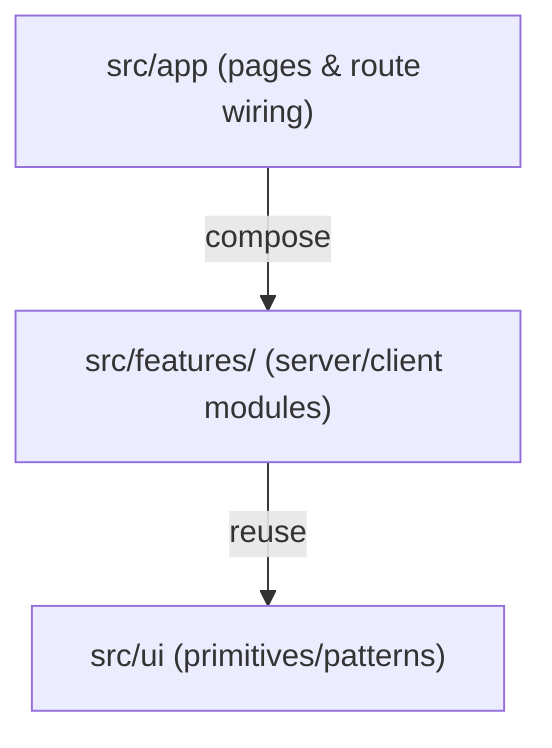

# Plan Refactor UI (Frontend) - Feature-driven, Public-only

Mục tiêu của plan này là refactor và tổ chức lại phần UI frontend của ứng dụng Next.js để:

- Gọn gàng, khoa học, dễ bảo trì.
- Dễ mở rộng khi thêm page/feature.
- Rõ ranh giới Server Components vs Client Components (đúng best practices Next.js).
- Tuân theo kiến trúc `feature-driven` (theo tính năng/route/domain), thay vì gom theo “layer” thuần.

Phạm vi áp dụng:

- `public_only`: gồm trang marketing/public catalog, auth public (login/signup/...), checkout, và các shared UI/reader phục vụ client web.
- Không đụng phần `src/app/admin/*` trong giai đoạn này.

---

## 1. Đánh giá hiện trạng (UI cấu trúc & vấn đề)

### 1.1 Trộn trách nhiệm giữa Server/page wiring và UI component lớn

Nhiều component client quan trọng đang tồn tại ngay theo cấu trúc route, ví dụ:

- `[src/app/tai-lieu/[id]/[slug]/ProductPageClient.tsx](src/app/tai-lieu/[id]/[slug]/ProductPageClient.tsx)`
- `[src/app/tai-lieu/[id]/[slug]/PreviewGallery.tsx](src/app/tai-lieu/[id]/[slug]/PreviewGallery.tsx)`

Trong khi đó page server vẫn có logic dữ liệu/transform đáng kể (ví dụ tính stats reviews/sold), khiến việc mở rộng theo feature dễ làm file phình to.

### 1.2 DRY chưa tốt giữa các page public

Các logic tương tự đang xuất hiện ở nhiều page:

- Tính `reviewStats` (avg/count từ `document_reviews`) và `soldStats` (từ `permissions`) trong:
  - `[src/app/page.tsx](src/app/page.tsx)`
  - `[src/app/tai-lieu/page.tsx](src/app/tai-lieu/page.tsx)`

Các helper/flow khác cũng có dấu hiệu lặp:

- `deviceId`/`registerDeviceAndSession` ở nhiều nơi (ví dụ `SecureReader`, `DashboardClient`).

### 1.3 Shell/layout không nhất quán giữa các route

Đa số trang public dùng:

- `[src/components/layout/PublicLayout.tsx](src/components/layout/PublicLayout.tsx)` (Header + main + Footer)

Nhưng `/dashboard` hiện tại tự dựng:

- Header và footer theo cách riêng trong `[src/app/dashboard/page.tsx](src/app/dashboard/page.tsx)`

Điều này làm style/composition khác nhau và khiến refactor đồng nhất khó hơn.

### 1.4 Component quá lớn/đa trách nhiệm

- `[src/components/SecureReader.tsx](src/components/SecureReader.tsx)` đang chứa đồng thời:
  - Fetch PDF qua `/api/secure-pdf`
  - Render PDF.js lên canvas
  - Security guard overlays + event listeners chặn hành vi (copy/cut/printscreen/...)
  - Điều khiển scale/page rendering

- `[src/components/DocumentCard.tsx](src/components/DocumentCard.tsx)` quản lý:
  - UI card + pointer tilt
  - Modal preview + focus management
  - render CTA và badge

Việc gom nhiều trách nhiệm trong một file khiến bảo trì và test khó hơn khi thay đổi yêu cầu UI hoặc guard logic.

---

## 2. Đề xuất kiến trúc (Feature-driven + tách Server/Client)

### 2.1 Nguyên tắc kiến trúc

1. **Feature-driven architecture**: mỗi feature (documents list/detail/read, auth, checkout, dashboard) có thư mục riêng.
2. **Server vs Client rõ ràng**:
   - Server: `getXyzData.ts` / `getXyzStats.ts` (fetch & transform dữ liệu)
   - Client: `XyzClient.tsx` / `components/` có `use client` (interactive UI)
3. **UI primitives/patterns tách riêng dần** (không nhất thiết “Atomic Design” full ngay từ đầu, nhưng nên chuẩn hoá dần các wrapper hay pattern):
   - `RevealOnScroll`, modal helpers, skeletons, card/image/cta primitives.
4. **composition qua route/page**: `src/app/**/page.tsx` chỉ “wiring/compose”, hạn chế nhúng logic dữ liệu sâu.

### 2.2 Sơ đồ tổng quan



### 2.3 Cấu trúc thư mục mới (gợi ý)

```text
src/
  app/                      (giữ route structure, chỉ compose)
  features/
    layout/
      components/
        PublicLayout.tsx
        Header.tsx
        Footer.tsx
      hooks/
        useUserRole.ts

    documents/
      list/
        components/
          DiscoveryFilters.tsx
          DocumentCard.tsx
          DocumentCardSkeleton.tsx
        server/
          getDocumentsListData.ts
          getDocumentsListStats.ts

      detail/
        components/
          ProductPageClient.tsx
          PreviewGallery.tsx
        server/
          getProductPageData.ts

      read/
        components/
          SecureReader.tsx
          (sau có thể tách subcomponents/hook theo mục tiêu bảo trì)
        server/
          (nếu cần) getReadAccessUiState.ts

    auth/
      components/
        AuthCard.tsx
        LoginForm.tsx
        SignupForm.tsx
        ForgotPasswordForm.tsx
        ResetPasswordForm.tsx

    checkout/
      components/
        CheckoutForm.tsx

    dashboard/
      components/
        DashboardClient.tsx

  ui/
    primitives/
      (nếu muốn tiến tới design system: Button/Card/Input/Badge...)
    patterns/
      RevealOnScroll.tsx
      ModalShell.tsx (nếu bạn muốn chuẩn hoá dần)

  hooks/
    (chỉ giữ những hook thật sự dùng nhiều ngoài feature)
```

---

## 3. Kế hoạch hành động (cụ thể, theo cụm, không viết code)

## Bước 1: Chuẩn hoá conventions & boundaries

- Đặt quy ước bắt buộc:
  - File client phải ở `features/**/components/**` hoặc `features/**/**.tsx` có `use client`.
  - File server/data fetching ở `features/**/server/**` và không chứa `use client`.
- Quy ước naming:
  - `getXyzData.ts` / `getXyzStats.ts` cho server.
  - `XyzClient.tsx` cho interactive UI.

Tác động: thay đổi imports theo sau, nhưng hạn chế logic thay đổi để tránh rủi ro.

## Bước 2: Chuẩn hoá layout/shell cho public routes

- Di chuyển / gom:
  - `PublicLayout`, `Header`, `Footer`, `useUserRole` vào `src/features/layout/*`.
- Cập nhật `/dashboard` để dùng cùng shell nếu mục tiêu “public_only” vẫn bao gồm dashboard UI.

File neo đề xuất:
- `[src/components/layout/PublicLayout.tsx](src/components/layout/PublicLayout.tsx)`
- `[src/components/Header.tsx](src/components/Header.tsx)`
- `[src/components/Footer.tsx](src/components/Footer.tsx)`
- `[src/hooks/useUserRole.ts](src/hooks/useUserRole.ts)` (hoặc chuyển vào feature layout theo kiến trúc)
- `[src/app/dashboard/page.tsx](src/app/dashboard/page.tsx)` (điều chỉnh composition)

## Bước 3: Gom “documents list” (Home + `/tai-lieu`)

- Tách dữ liệu & stats:
  - Trích logic tính `reviewStats` + `soldStats` ra `features/documents/list/server/getDocumentsListStats.ts`.
  - Home (`src/app/page.tsx`) và TaiLieu (`src/app/tai-lieu/page.tsx`) gọi server helper thay vì tự nhúng accumulator.
- Tách UI:
  - Đưa `DocumentCard`, `DiscoveryFilters`, `DocumentCardSkeleton` vào `features/documents/list/components`.

File neo:
- `[src/app/page.tsx](src/app/page.tsx)`
- `[src/app/tai-lieu/page.tsx](src/app/tai-lieu/page.tsx)`
- `[src/components/DocumentCard.tsx](src/components/DocumentCard.tsx)`
- `[src/components/DiscoveryFilters.tsx](src/components/DiscoveryFilters.tsx)`

## Bước 4: Gom “documents detail” (`/tai-lieu/[id]/[slug]`)

- Tách `ProductPageClient` và `PreviewGallery` vào:
  - `features/documents/detail/components/`
- Tùy chọn tiếp theo (nếu muốn nâng maintainability):
  - Logic fetch `reviews/comments/relatedDocs` đã được extract sang `features/documents/detail/server/getProductPageData.ts`.

File neo:
- `[src/app/tai-lieu/[id]/[slug]/page.tsx](src/app/tai-lieu/[id]/[slug]/page.tsx)`
- `[src/features/documents/detail/components/ProductPageClient.tsx](src/features/documents/detail/components/ProductPageClient.tsx)`
- `[src/features/documents/detail/components/PreviewGallery.tsx](src/features/documents/detail/components/PreviewGallery.tsx)`
- `[src/features/documents/detail/server/getProductPageData.ts](src/features/documents/detail/server/getProductPageData.ts)`

## Bước 5: Gom “documents read” (`/doc/[id]/read`)

- Di chuyển `SecureReader` sang:
  - `features/documents/read/components/SecureReader.tsx`
- Chuẩn bị refactor nội bộ:
  - Sau khi move thư mục, tách dần trong `SecureReader.tsx` thành các phần nhỏ:
    - `usePersistentDeviceId` (hoặc hook tương đương)
    - `usePdfFetchAndDecode`
    - `PdfCanvasRenderer`
    - `useReaderSecurityGuards` (có thể gom các event listeners vào một hook)

File neo:
- `[src/features/documents/read/components/SecureReader.tsx](src/features/documents/read/components/SecureReader.tsx)`
- `[src/app/doc/[id]/read/page.tsx](src/app/doc/[id]/read/page.tsx)`

## Bước 6: Gom auth pages

- Tách UI form dùng chung thành components trong:
  - `features/auth/components/*`
- Giữ server actions (nếu có) ở `src/app/**/actions.ts` để đảm bảo boundary đúng của Next.

File neo:
- `[src/features/auth/components/AuthPageShell.tsx](src/features/auth/components/AuthPageShell.tsx)`
- `[src/features/auth/components/LoginForm.tsx](src/features/auth/components/LoginForm.tsx)`
- `[src/features/auth/components/SignupForm.tsx](src/features/auth/components/SignupForm.tsx)`
- `[src/features/auth/components/ForgotPasswordForm.tsx](src/features/auth/components/ForgotPasswordForm.tsx)`
- `[src/features/auth/components/ResetPasswordForm.tsx](src/features/auth/components/ResetPasswordForm.tsx)`
- `[src/app/login/page.tsx](src/app/login/page.tsx)`
- `[src/app/signup/page.tsx](src/app/signup/page.tsx)`
- `[src/app/forgot-password/page.tsx](src/app/forgot-password/page.tsx)`
- `[src/app/reset-password/page.tsx](src/app/reset-password/page.tsx)`

## Bước 7: Gom checkout & dashboard (chỉ UI)

- Checkout:
  - `src/app/checkout/page.tsx` hiện chứa `CheckoutForm` inline client component.
  - Tách `CheckoutForm` ra `features/checkout/components/CheckoutForm.tsx`.
- Dashboard:
  - `DashboardClient` đưa vào `features/dashboard/components/` và thống nhất shell composition.

File neo:
- `[src/features/checkout/components/CheckoutForm.tsx](src/features/checkout/components/CheckoutForm.tsx)`
- `[src/features/dashboard/components/DashboardClient.tsx](src/features/dashboard/components/DashboardClient.tsx)`

---

## 4. Lịch triển khai an toàn (không đụng logic trước)

Khuyến nghị tiến theo thứ tự để giảm rủi ro:

1. Di chuyển layout/shell (`PublicLayout`, `Header`, `Footer`) + cập nhật import.
2. Tách documents list server stats helper và gom UI components.
3. Di chuyển documents detail UI + (tuỳ chọn) extract server data fetch.
4. Move `SecureReader` vào feature và sau đó tách dần subcomponents/hook.
5. Gom auth/checkout/dashboard cuối.

Sau mỗi cụm di chuyển:

- Chạy `next build` (hoặc `next lint`) để đảm bảo boundary server/client không bị vỡ.
- Chạy smoke test: Home, `/tai-lieu`, `/tai-lieu/[id]/[slug]`, `/doc/[id]/read`, `/login`.

---

## 5. Tiêu chí chấp nhận (Done Definition)

Một lần refactor coi là đạt nếu:

- Không còn logic dữ liệu/stats quá nặng nằm trong `src/app/page.tsx` và `src/app/tai-lieu/page.tsx` (đã chuyển sang server helper).
- Các client component lớn được gom theo feature (documents/auth/checkout/dashboard).
- Boundary `use client` rõ ràng và build không fail.
- Imports trở nên “dễ đoán”: nhìn vào route là suy ra feature liên quan.

