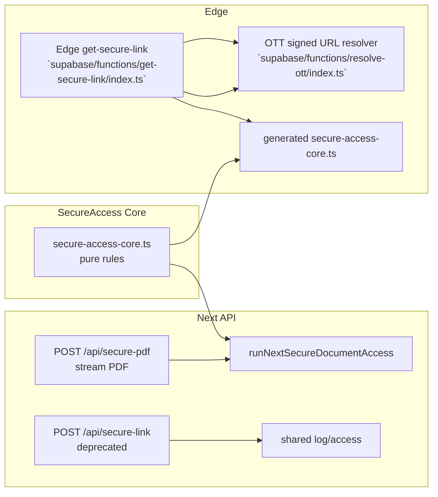
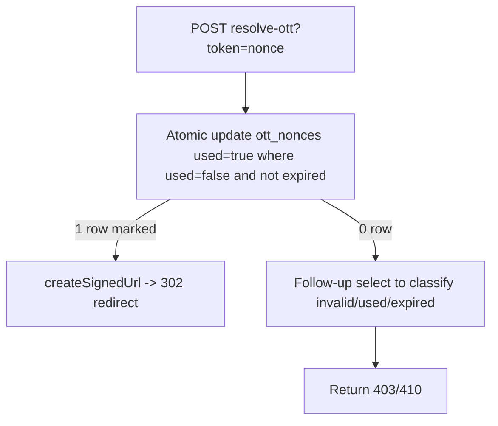

# Đánh giá ứng dụng Doc2Share (Round 1)

> **Ngày đánh giá:** 2026-04-02  
> **Phiên bản repo:** `0.1.0`  
> **Tech stack (tóm tắt):** Next.js 14 (App Router) · Supabase (PostgreSQL/Auth/Storage/Edge) · Tailwind CSS · TypeScript · Node 22+

---

## Tóm tắt nhanh

Doc2Share là một marketplace tài liệu giáo dục theo mô hình **secure access**: người dùng mua qua **SePay/VietQR**, sau đó truy cập tài liệu PDF thông qua lớp **Secure Reader** (watermark/traceability + deterrence). Luồng thanh toán được xử lý trên route Next (`POST /api/webhook/sepay`), còn cơ chế truy cập/giới hạn được tập trung ở `src/lib/secure-access/secure-access-core.ts` và được đồng bộ sang Edge (`get-secure-link`) theo kỷ luật “một nguồn sự thật”.

**Điểm mạnh nổi bật**
- **Secure access rules thuần & test được:** `secure-access-core.ts` tách khỏi I/O, dùng chung cho Next và Edge (sync/deploy rõ ràng qua `docs/SECURE-ACCESS-SYNC.md`).
- **Audit trail rõ nghĩa:** `src/lib/access-log.ts` ghi `access_logs` (action `secure_pdf`) và Edge ghi logs/observability riêng cho action `get_secure_link`.
- **RBAC/Single-session có tầng lớp:** middleware RBAC cho `/admin/*` (`src/middleware.ts` + `src/lib/supabase/middleware.ts`) và “single session” ở trang đọc (`src/app/doc/[id]/read/page.tsx`).
- **Payment orchestrator có ports/adapters:** checkout dùng `runCheckoutOrchestrator` (`src/app/checkout/actions.ts` + `src/lib/domain/checkout/...`) và webhook xử lý cập nhật trong một transaction DB (`supabase/migrations/...atomic_webhook_completion.sql`).
- **High-value doc có chế độ ảnh:** Secure Reader gọi `/api/secure-document-image` khi backend trả cờ `X-D2S-Is-High-Value=true`.

**Rủi ro / điểm cần cải thiện ưu tiên**
- **Webhook SePay thiếu idempotency ở route handler:** trong `src/lib/webhooks/sepay.ts` không thấy gọi `register_webhook_event` (trong khi migration có sẵn hàm + test integration tồn tại).
- **Amount mismatch trả HTTP 200 “ok”** trong `handleSePayWebhook`, có thể làm SePay không retry đúng cách.
- **Edge OTT “one-time” có rủi ro race** trong `supabase/functions/resolve-ott/index.ts` (select-check-update không nguyên tử).
- **Deterrence là phòng ngừa mức client-side:** Secure Reader chặn một số hành vi (copy/cut/context-menu/PrintScreen) nhưng bản chất vẫn có rủi ro trích xuất nếu đối tượng có kỹ thuật cao (giải pháp hiện tại thiên về traceability + deterrence hơn là hard DRM).
- **Client-side “auto-heal” khi SESSION_BINDING_FAILED:** `usePdfFetchAndDecode.ts` tự gọi `registerDeviceAndSession(...)` rồi retry, có thể tăng khả năng “session switching” nếu attacker có cookie session hợp lệ và quota thiết bị.

---

## Phạm vi & phương pháp

### Phạm vi đánh giá (đã khảo sát)
- **Auth & Admin RBAC:** `src/middleware.ts`, `src/lib/supabase/middleware.ts`, `src/app/doc/[id]/read/page.tsx`, `src/lib/admin/guards-core.ts`, `src/lib/admin/guards.ts`, `src/app/login/actions.ts`.
- **Single session binding:** `src/lib/auth/single-session/registerDeviceAndSession.ts`, `src/lib/auth/single-session/validate.ts`.
- **Checkout & Payment:** `src/app/checkout/actions.ts`, `src/lib/domain/checkout/...`, `src/app/api/webhook/sepay/route.ts`, `src/lib/webhooks/sepay.ts`, core parse `src/lib/payments/sepay-webhook-core.ts`.
- **Secure access (core + handlers + Edge):** `src/lib/secure-access/secure-access-core.ts`, `src/lib/secure-access/run-next-secure-document-access.ts`, `src/app/api/secure-pdf/route.ts`, Edge `supabase/functions/get-secure-link/index.ts` + generated core `supabase/functions/get-secure-link/secure-access-core.ts`, OTT `supabase/functions/resolve-ott/index.ts`.
- **Secure Reader & chống trích xuất (deterrence + watermark):** `src/features/documents/read/components/SecureReader.tsx`, `src/features/documents/read/hooks/useReaderSecurityGuards.ts`, `src/features/documents/read/hooks/usePdfFetchAndDecode.ts`, `src/features/documents/read/components/PdfCanvasRenderer.tsx`, `src/features/documents/read/components/SecureImageRenderer.tsx`, watermark issuer/overlay.
- **Upload & Pipeline:** `src/app/admin/documents/upload-document-with-metadata-action.ts`, `src/lib/domain/document-upload/services/upload-orchestrator.ts`, `src/app/api/internal/document-pipeline/run/route.ts`.
- **Observability & Audit:** `src/lib/access-log.ts`, `src/lib/observability/log-observability-event.ts`, reader observability endpoint.
- **Testing/CI/Docs:** `TESTING.md`, `/.github/workflows/ci.yml`, các test unit/integration/e2e chính liên quan đến secure access/webhook/watermark.
- **DB/RLS/RPC evidence:** các migration then chốt: `supabase/migrations/20250220000013_webhook_idempotency.sql`, `...20250220000010_atomic_webhook_completion.sql`, `...20250220000008_security_hardening_p0.sql`, `...20250220000025_admin_read_least_privilege.sql`, `...20250220000005_active_sessions_insert.sql`.

### Dữ liệu đầu vào
Phần đánh giá dựa trên evidence trực tiếp từ code và tài liệu trong repo (được liệt kê ở Appendix).

---

## Sơ đồ luồng

### 1) Checkout -> Webhook -> Permissions -> Secure Reader
```mermaid
flowchart TB
  subgraph checkout[Checkout]
    A[createCheckoutVietQr<br/>`src/app/checkout/actions.ts`] --> B[runCheckoutOrchestrator<br/>`src/lib/domain/checkout/...`]
    B --> C[RPC create_checkout_order]
    C --> D[orders.external_id + amount]
    D --> E[VietQR link build<br/>`src/lib/payments/vietqr.ts`]
  end

  subgraph pay[SePay Webhook]
    F[SePay POST<br/>`src/app/api/webhook/sepay/route.ts`] --> G[handleSePayWebhook<br/>`src/lib/webhooks/sepay.ts`]
    G --> H[extract refs + amount<br/>`src/lib/payments/sepay-webhook-core.ts`]
    G --> I[RPC complete_order_and_grant_permissions]
  end

  subgraph access[Secure Access + Reader]
    J[Doc read page<br/>`src/app/doc/[id]/read/page.tsx`] --> K[SecureReader UI]
    K --> L{HighValue?}
    L -->|No| M[POST /api/secure-pdf<br/>`src/app/api/secure-pdf/route.ts`]
    L -->|Yes| N[POST /api/secure-document-image]
    M --> O[runNextSecureDocumentAccess<br/>`src/lib/secure-access/run-next-secure-document-access.ts`]
    N --> P[runNextSecureDocumentAccess + rasterize<br/>`src/lib/secure-access/ssw/...`]
  end
```

### 2) Secure access core -> Next vs Edge + OTT


---

## Đánh giá chi tiết (7 mảng)

### 1) `feat` (Chức năng & luồng nghiệp vụ)

**Đã làm được**
- Checkout + tạo order + xây `transferContent`/VietQR thông qua `src/app/checkout/actions.ts` và `src/lib/domain/checkout/...`.
- Webhook SePay cập nhật `orders` và cấp `permissions` theo transaction DB qua RPC `complete_order_and_grant_permissions` (`supabase/migrations/20250220000010_atomic_webhook_completion.sql`).
- Secure Reader có 2 chế độ:
  - Chế độ PDF canvas render: `POST /api/secure-pdf` + `pdfjs-dist` + watermark overlay (`src/features/documents/read/components/PdfCanvasRenderer.tsx`).
  - Chế độ High-value: backend trả header cờ `X-D2S-Is-High-Value=true`, frontend chuyển sang image mode qua endpoint `/api/secure-document-image` (`src/features/documents/read/components/SecureReader.tsx`, `src/features/documents/read/hooks/usePdfFetchAndDecode.ts`).
- Admin upload có orchestrator chuẩn bị assets và enqueue pipeline xử lý bất đồng bộ.

**Điểm mạnh**
- Payment lifecycle được thiết kế rõ ràng với DB/RPC atomic completion.
- Secure Reader gắn watermark/forensic payload và có fallback watermark degraded để tránh “mù audit” khi thiếu watermark headers (`usePdfFetchAndDecode.ts`).

**Rủi ro / yếu điểm (tập trung vào tác động thực tế)**
- **Webhook idempotency chưa hiện diện ở handler:** migration có `register_webhook_event` (và test integration), nhưng trong `src/lib/webhooks/sepay.ts` không thấy gọi hàm này (được suy ra từ việc search `register_webhook_event` trong `src/` chỉ có test). Hậu quả: SePay replay có thể tạo nhiều lượt log/“complete attempt” dù `permissions` có `ON CONFLICT` ở migration.
- **Amount mismatch trả HTTP 200 (không đúng kỳ vọng retry):** `handleSePayWebhook` trả `{ ok: true, status: 200 }` ở nhánh amount mismatch, nên SePay có thể coi như success và không retry.
- **Match order có thể “chọn nhầm” khi fallback trả nhiều row:** `matchedOrders = fallbackRows` (limit 2) nhưng vẫn `order = matchedOrders[0]` và không trả 409 ambiguous. Rủi ro sai đơn cấp quyền (tính đúng đắn thanh toán bị ảnh hưởng).
- **Client-side deterrence không phải hard DRM:** với non-high-value, browser vẫn tải `rawPdfBlob` và `pdfjs` render; người dùng kỹ thuật vẫn có thể trích xuất nội dung từ blob/network.

**Khuyến nghị**
- Bổ sung `register_webhook_event` trong `src/lib/webhooks/sepay.ts` và xử lý theo kết quả `should_process/current_status`.
- Chuẩn hóa semantics HTTP codes cho SePay: amount mismatch/logic lỗi nên trả 400 để SePay retry theo config “code không nằm 200-299”.
- Thực hiện guard `matchedOrders.length > 1` → trả 409 ambiguous.
- Xem xét chiến lược hard enforcement theo tier (SSW/SSW+rendered images) cho nhóm nhạy cảm, hoặc tăng cường “anti-extract” theo model threat.

---

### 2) `arch` (Kiến trúc & code quality)

**Đã làm được**
- **Core thuần & testable:** `secure-access-core.ts` tách khỏi Supabase/HTTP, gồm device/session/permission/rate math.
- **Ports/adapters & DI pattern:** checkout và upload có `ports.ts` + `adapters/supabase` + `adapters/mock` + orchestrator.
- **ActionResult thống nhất:** `src/lib/action-result.ts` giúp client xử lý thống nhất giữa server action.
- **Kỷ luật Node ↔ Edge sync:** Edge core là AUTO-GENERATED từ `src/lib/secure-access/secure-access-core.ts` và có tài liệu sync quy trình (`docs/SECURE-ACCESS-SYNC.md`).

**Điểm mạnh**
- Đường biên core/I/O rõ ràng (đặc biệt ở secure access).
- Watermark có “contract” (`src/lib/watermark/watermark-contract.ts`) và payload xuất/nhập có type.

**Rủi ro / điểm còn thiếu**
- Một số chỗ “thiết kế đã có” nhưng “handler chưa dùng”: ví dụ `webhook_events`/`register_webhook_event` đã có migration + test, nhưng SePay handler hiện không gọi → mismatch giữa “arch DB contract” và “application handler”.

**Khuyến nghị**
- Audit “contract drift” kiểu này theo checklist: nếu migration có RPC/Audit contract, handler phải có unit/integration để assert contract được dùng.

---

### 3) `ui` (UI/UX & trải nghiệm)

**Đã làm được**
- Secure Reader có giao diện tối giản nhưng có đủ controls (zoom, page nav, close) và có `aria-label` cho các nút điều khiển (`SecureReader.tsx`).
- Reader có trạng thái loading/error rõ ràng và hướng dẫn retry/đăng nhập lại.
- High-value mode được bật/tắt theo cờ backend để người dùng không phải hiểu kỹ thuật.

**Điểm mạnh**
- Deterrence UI hợp lý theo hướng “giảm rủi ro phổ thông”: che đen khi tab ẩn (`document.visibilityState`) và khi PrintScreen/Snapshot.
- Watermark overlay render trên canvas hợp nhất với UI (không cần thay đổi UX lớn).

**Rủi ro**
- Deterrence focus chủ yếu vào keyboard/contextmenu/visibility; không ngăn được kỹ thuật có chủ đích (extension, devtools/network capture, camera capture).
- Một số chỗ thông điệp “SESSION_BINDING_FAILED auto-heal” hiện do client; UX khi bị session mismatch có thể “recover” nhưng vẫn cần minh bạch và hạn chế lạm dụng.

---

### 4) `perf` (Hiệu năng & độ ổn định)

**Đã làm được**
- **Streaming PDF (Next):** `src/app/api/secure-pdf/route.ts` ưu tiên `.asStream()` để giảm peak RAM và cải thiện TTFB.
- **Timeout & abort:** `usePdfFetchAndDecode.ts` tạo AbortController timeout 60s cho `fetchDoc`.
- **Canvas render có huỷ task:** `PdfCanvasRenderer` cancel render task cũ khi đổi page/scale.
- **High-value image mode có in-memory cache:** `/api/secure-document-image` dùng Map cache với TTL 5 phút + giới hạn entries 10 (`src/app/api/secure-document-image/route.ts`).
- Middleware có matcher loại trừ static/assets trong `src/lib/supabase/middleware.ts`.

**Rủi ro / điểm cần chú ý**
- In-memory cache trong route image mode là cache per-instance: khi scale ngang, cache hit giảm (nhưng vẫn đúng chức năng).
- PDFjs render + watermark overlay có chi phí CPU; cần đo trong thực tế với PDF lớn/zoom 2x.
- `useReaderSecurityGuards.ts` chặn nhiều listener toàn trang (copy/cut/drag/keydown) có thể ảnh hưởng user experience trên trang đọc.

---

### 5) `sec` (Bảo mật & tuân thủ)

**Đã làm được (nền tảng)**
- **RLS + least privilege evidence qua migration:**
  - `supabase/migrations/20250220000008_security_hardening_p0.sql`: admin-only insert `security_logs`, revoke `documents.file_path` select cho anon/authenticated.
  - `supabase/migrations/20250220000025_admin_read_least_privilege.sql`: chỉ `super_admin` xem `access_logs`, `security_logs`, `webhook_events`, `observability_events`.
- **Secure access gate:** `src/lib/secure-access/run-next-secure-document-access.ts` kiểm tra:
  - user auth,
  - profile locked/inactive/banned_until,
  - device limit,
  - session/device binding (active_sessions),
  - permission + expiry,
  - rate limit theo user và high frequency theo document distinct count.
- **Audit log:** `src/lib/access-log.ts` ghi `access_logs` với action `secure_pdf`.
- **Edge secure-link:** `supabase/functions/get-secure-link/index.ts` kiểm tra active_sessions device binding, document permission, rate limit theo action `get_secure_link`.
- **OTT “one-time” (thiết kế):**
  - Edge `get-secure-link` tạo `ott_nonces` và trả `resolve-ott?token=<nonce>` thay vì signed URL trực tiếp.
  - `supabase/functions/resolve-ott/index.ts` kiểm tra nonce tồn tại, `used=false` rồi tạo signed URL ngắn và chuyển hướng.

**Rủi ro / yếu điểm bảo mật quan trọng**
- **Race condition trong OTT resolver (high impact nếu attacker gọi song song):**
  - `resolve-ott/index.ts` làm theo pattern: `select maybeSingle` → kiểm tra `ott.used` → `update set used=true` → createSignedUrl.
  - Không có transaction/locking/`update where used=false returning`, nên 2 request gần như đồng thời có thể cả hai cùng thấy `used=false` và tạo 2 signed URL trước khi `used` cập nhật.
  - Evidence: `supabase/functions/resolve-ott/index.ts` (đoạn select + if (ott.used) + update used).
- **Webhook idempotency policy contract bị thiếu ở handler SePay:**
  - Migration `supabase/migrations/20250220000013_webhook_idempotency.sql` có sẵn `register_webhook_event` + unique index `(provider,event_id)`, nhưng `src/lib/webhooks/sepay.ts` không gọi.
- **Client-side auto-heal có thể tăng bề mặt “session switching”:**
  - `usePdfFetchAndDecode.ts` intercept mọi `403` với `body.code==="SESSION_BINDING_FAILED"` và gọi `registerDeviceAndSession(deviceId, signalsSummary, hardwareHash)` rồi retry.
  - Nếu user còn quota thiết bị (`MAX_DEVICES_PER_USER=2`) thì attacker với cookie session hợp lệ có thể chuyển active session sang device họ kiểm soát (tùy threat model).
  - Evidence: `src/features/documents/read/hooks/usePdfFetchAndDecode.ts` nhánh auto-heal trước khi retry.
- **Deterrence không phải hard block:** `useReaderSecurityGuards.ts` chủ yếu là deterrence (preventDefault copy/cut/keydown/contextmenu/PrintScreen) và che đen khi tab ẩn.

**Khuyến nghị**
- Fix OTT race bằng “atomic mark used”:
  - thay vì select-check-update, dùng `update ott_nonces set used=true where id=... and used=false returning storage_path` (hoặc RPC có transaction/locking).
- Bổ sung webhook idempotency trong SePay handler:
  - gọi `register_webhook_event(p_provider="sepay", p_event_id, p_payload_hash, ...)`,
  - nếu `should_process=false` → trả 200/ignored, không complete order.
- Điều chỉnh semantics HTTP với SePay:
  - amount mismatch nên trả 400 (để retry theo config “retry when non 200-299”).
- Hạn chế auto-heal theo reason:
  - tách `no_active_session` vs `device_mismatch`; chỉ auto-heal cho trường hợp nên phục hồi (tránh cho device mismatch/hijack).

---

### 6) `test` (Kiểm thử & CI/CD)

**Đã làm được**
- Unit tests dùng `node:test` và đặt theo quy ước `*.test.ts` gần module.
- Secure access có unit tests cho core rules (logic pure).
- Payment webhook có unit test parse payload (`src/lib/payments/sepay-webhook.test.ts`).
- Có integration test:
  - `src/test-integration/webhook-idempotency.test.ts` (RPC `register_webhook_event`).
  - `src/test-integration/rls-admin.test.ts` (RLS visibility).
- CI chạy:
  - `npm run check:sync` (Node ↔ Edge),
  - `npm run lint`,
  - `npm run test`,
  - `npm run build`,
  - E2E tests `npm run test:e2e` (jobs riêng).

**Rủi ro / lỗ hổng test**
- Nếu webhook handler SePay thiếu idempotency call, hiện tại unit/integration test có thể chưa bao phủ đúng “route-level idempotency” (tức test `POST /api/webhook/sepay` không thấy gọi RPC register).  
  - Evidence: `src/test-integration/webhook-idempotency.test.ts` chỉ test RPC, không test route handler.
- Integration tests với Supabase local không chắc chạy trong CI (ci.yml chỉ thấy unit + e2e + observability).

**Khuyến nghị**
- Thêm route-level integration/E2E cho `POST /api/webhook/sepay`:
  - cùng payload retry replay → đảm bảo permissions/granted_at không bị duplicate theo design,
  - mismatch amount → phải trả HTTP 400 để SePay retry.

---

### 7) `docs` (Tài liệu & hướng dẫn sử dụng)

**Đã làm được**
- `README.md` mô tả tech stack + setup + cấu trúc chính và payment flow.
- `ARCHITECTURE.md` và `RUNBOOK.md` cung cấp hướng dẫn mở rộng, vận hành và xử lý sự cố.
- `TESTING.md` nêu rõ framework test, vị trí file, và cách chạy unit/integration/E2E.
- Tài liệu secure access sync: `docs/SECURE-ACCESS-SYNC.md` là điểm cộng lớn vì quy định “một nguồn sự thật” và cách sync/deploy Edge.
- Có checklist route-level cho secure reader + webhook: `docs/INTEGRATION-CHECKLIST-checkout-webhook-tu-sach-secure-reader-route-level.md`.

**Rủi ro**
- Do thiếu “contract test” cho webhook idempotency route-level, tài liệu/migration có thể tạo cảm giác đã idempotent trong khi handler chưa dùng.

---

## Chấm điểm tổng hợp

| Tiêu chí | Điểm (1-10) | Nhận xét ngắn |
|---|---:|---|
| Kiến trúc & Tổ chức | 9.0 | Ports/adapters + core pure logic + sync kỷ luật. |
| Code Quality | 8.6 | TypeScript tốt, chia module rõ, naming nhất quán. |
| UI/UX & Accessibility | 8.0 | Có feedback/loading/error + `aria-label` cơ bản; deterrence UX ổn nhưng là client-side. |
| Hiệu năng & Độ ổn định | 8.2 | Streaming + timeout + caching high-value image mode; cần đo với PDF lớn. |
| Bảo mật & Tuân thủ | 7.4 | Nền RLS/secure access tốt; nhưng OTT race + webhook idempotency route-level + semantics HTTP là các lỗ hổng quan trọng. |
| Testing & CI/CD | 7.8 | Có suite unit + E2E + sync check; nhưng route-level webhook idempotency chưa rõ. |
| Tài liệu hóa & vận hành | 9.2 | README/ARCHITECTURE/RUNBOOK/TESTING/SECURE-ACCESS-SYNC đủ độ chi tiết. |

**Tổng trung bình (ước lượng): `8.3/10`**

---

## Ưu tiên hành động (P0/P1/P2)

### P0 (Khẩn cấp, high impact)
1. **Fix webhook SePay idempotency ở route handler**
   - Thêm gọi `register_webhook_event` trong `src/lib/webhooks/sepay.ts` (hoặc trước khi complete order), và dùng kết quả `should_process`.
   - Evidence: migration `supabase/migrations/20250220000013_webhook_idempotency.sql` có sẵn nhưng handler chưa dùng.
2. **Chuẩn hóa HTTP status cho amount mismatch**
   - Đổi amount mismatch sang HTTP 400 (hoặc code thuộc nhóm “retry” theo config SePay).
3. **Chặn ambiguous order match**
   - Nếu query match trả nhiều row, trả 409 thay vì chọn `matchedOrders[0]`.
4. **Sửa OTT race condition**
   - Làm “atomic used marking” trong `supabase/functions/resolve-ott/index.ts` (update with condition + returning).

### P1 (Quan trọng, medium effort)
1. **Giới hạn auto-heal theo reason**
   - Trong `usePdfFetchAndDecode.ts`, chỉ auto-heal cho `no_active_session`, hạn chế với `device_mismatch`.
2. **Thêm route-level tests cho `POST /api/webhook/sepay`**
   - Replay cùng payload và assert DB state/permissions + HTTP semantics.
3. **Audit drift/contract**
   - “migration có RPC/Audit contract” => handler phải có test/logic tương ứng.

### P1 Execution Plan (Quan trọng, medium effort)
Triển khai các thay đổi P1 theo đúng bằng chứng (evidence) trong document này, nhằm giảm rủi ro UX sai (auto-heal quá đà) và tăng độ chắc cho contract kiểm thử ở route-level.

#### 1) P1 #1: Giới hạn auto-heal theo reason
**Bối cảnh (evidence):**
- Client `src/features/documents/read/hooks/usePdfFetchAndDecode.ts` hiện auto-heal cho mọi `403` có `body.code === "SESSION_BINDING_FAILED"`.
- Backend `src/lib/secure-access/run-next-secure-document-access.ts` trả `code: "SESSION_BINDING_FAILED"` cho cả 2 reason: `no_active_session` và `device_mismatch`.

**Thay đổi đề xuất:**
- Backend: mở rộng payload lỗi khi session binding fail để client phân biệt reason.
  - Tại `src/lib/secure-access/run-next-secure-document-access.ts`, khi `sessionGate.reason === "no_active_session" | "device_mismatch"`, trả thêm field `reason`.
- Client: trong `src/features/documents/read/hooks/usePdfFetchAndDecode.ts`, chỉ auto-heal khi:
  - `res.status === 403`
  - `body.code === "SESSION_BINDING_FAILED"`
  - `body.reason === "no_active_session"`
  - Không auto-heal cho `device_mismatch` (trả lỗi trực tiếp với thông điệp phù hợp).

**Tiêu chí chấp nhận:**
- Khi `no_active_session`: vẫn tự phục hồi như hiện tại.
- Khi `device_mismatch`: không gọi `registerDeviceAndSession(...)` và không “session switching” ngoài ý muốn.

**Hướng kiểm chứng:**
- Với cùng document/device:
  - Tạo tình huống “không có active session” => 403 rồi retry sau khi auto-register.
  - Tạo tình huống “device mismatch” => 403 trả về đúng UX, không retry/register.

#### 2) P1 #2: Thêm route-level tests cho `POST /api/webhook/sepay`
**Bối cảnh (evidence):**
- Hiện có integration test cho RPC `register_webhook_event` trong `src/test-integration/webhook-idempotency.test.ts`, nhưng chưa test trực tiếp route handler `POST /api/webhook/sepay`.
- `docs/INTEGRATION-CHECKLIST-checkout-webhook-tu-sach-secure-reader-route-level.md` đã mô tả checklist route-level (happy path, amount mismatch 400, idempotency).

**Thay đổi đề xuất:**
- Tạo test integration mới (Node `node:test`) trong `src/test-integration/` (ví dụ: `webhook-sepay-route-level.test.ts`) thực hiện:
  1. Happy path: gọi webhook với payload đúng => assert HTTP `200`, DB `orders.status='completed'`, `permissions` có dòng cho `(user_id, document_id)`.
  2. Amount mismatch: payload sai tiền => assert HTTP `400`, DB không thay đổi permissions (orders vẫn `pending`).
  3. Idempotency/replay: gửi lại cùng raw payload => assert lần 2 vẫn `200` nhưng không “grant lần 2” (hoặc `granted_at` không tăng theo thiết kế).

**Tiêu chí chấp nhận:**
- Test chạy được bằng `npm run test:integration` và bị skip nếu thiếu env (theo style hiện có trong `src/test-integration/*.test.ts`).
- Test xác thực đúng semantics HTTP và DB contract như yêu cầu P1.

**Hướng kiểm chứng:**
- Chạy trong môi trường Supabase local + Next server đang bật; cung cấp env theo checklist (tối thiểu `BASE_URL`, `WEBHOOK_SEPAY_API_KEY`, `SUPABASE_URL`, `SUPABASE_SERVICE_ROLE_KEY`, và user seed nếu cần).

#### 3) P1 #3: Audit drift/contract
**Bối cảnh (evidence):**
- Migration/DB contract có các hàm RPC cho webhook idempotency (`public.register_webhook_event`, `public.complete_webhook_event`).
- Cần đảm bảo handler route “dùng đúng contract” thông qua test/logic.

**Thay đổi đề xuất:**
- Gắn trách nhiệm “contract drift” vào suite route-level tests của P1 #2:
  - Assert `webhook_events.status` thay đổi đúng (`processing/processed/ignored/error` tùy case) sau mỗi test case.
  - Với case `amount_mismatch`/`hash_mismatch`, assert `webhook_events.error_message` đúng bucket (ví dụ `amount_mismatch` / `hash_mismatch`).
- (Tùy chọn) cập nhật checklist tài liệu `docs/INTEGRATION-CHECKLIST-checkout-webhook-tu-sach-secure-reader-route-level.md` để phản ánh rõ các assertion về `webhook_events.status`.

**Tiêu chí chấp nhận:**
- Có ít nhất 1 test case chứng minh handler đã gọi RPC contract (thông qua `webhook_events` rows).

**Hướng kiểm chứng:**
- Kiểm tra DB sau khi chạy từng test case, đảm bảo contract dùng thật.

## Verification checklist (chèn vào file)
- Auto-heal:
  - `no_active_session` => auto-heal OK
  - `device_mismatch` => không auto-heal
- Webhook route-level:
  - Happy path => 200 + `orders.completed` + `permissions` xuất hiện
  - Amount mismatch => 400 + không thêm permissions
  - Replay => 200 và không “grant lần 2”
- Contract drift:
  - `webhook_events.status` và `error_message` phản ánh đúng outcome

## Rollback/giảm rủi ro (chèn vào file)
- Auto-heal: nếu phát sinh UX regressions, revert điều kiện client (chỉ cho phép auto-heal lại khi đúng `no_active_session`/đúng reason), hoặc rollback backend field `reason`.
- Route-level tests: nếu test environment flaky, giảm phạm vi assertions (tập trung vào HTTP code + 1–2 DB checks), hoặc split thành 2 nhóm test (webhook-only và secure-pdf follow-up) để ổn định CI.

### P2 (Cải tiến sau)
1. **Hardening threat model cho non-high-value**
   - Nếu threat model yêu cầu cao, cân nhắc render chế độ ảnh/SSW theo tier ngay cả với một phần nội dung.
2. **Mở rộng tài liệu**
   - Thêm phần “Webhook semantics (HTTP codes/retry expectations)” vào `docs/TICH-HOP-SEPAY-VIETQR.md` hoặc tài liệu webhook.

### P0 Execution Plan (khẩn cấp, high impact)
Triển khai các thay đổi P0 theo đúng bằng chứng (evidence) trong document này, ưu tiên chống thất thoát/replay sai và đảm bảo semantics phản hồi cho SePay/OTT.

#### 1) P0 #1: Fix webhook SePay idempotency tại route handler
**Bối cảnh (evidence):** `register_webhook_event` có trong migration nhưng `src/lib/webhooks/sepay.ts` hiện không gọi.

**Hướng triển khai (đề xuất):**
1. Ở `POST /api/webhook/sepay` (`src/app/api/webhook/sepay/route.ts`), sinh `requestId` từ header `x-request-id` hoặc `crypto.randomUUID()` và truyền vào `handleSePayWebhook`.
2. Trong `handleSePayWebhook` (`src/lib/webhooks/sepay.ts`):
   - Tính `refs` = `extractOrderReferences(body)`.
   - Tính `payloadHash` = SHA-256 của canonical/stable JSON string của `body`.
   - Tạo `event_id` = `resolveEventId(body, refs, payloadHash)` từ `src/lib/payments/sepay-webhook-core.ts`.
   - Gọi RPC `register_webhook_event` (provider=`sepay`) để nhận `(should_process, current_status)`.
   - Nếu `should_process=false`:
     - `current_status == 'hash_mismatch'` => trả `409` (không complete đơn)
     - ngược lại (processed/ignored) => trả `200` (duplicate/ignored)
   - Nếu `should_process=true`:
     - Tiếp tục parse/match đơn/validate amount.
     - Luôn gọi `complete_webhook_event` ở mọi nhánh kết thúc: `processed` (thành công), `ignored` (bỏ qua có chủ đích), hoặc `error` (mismatch/ambiguous/logic lỗi).
3. Chuẩn hóa mapping trạng thái/response theo semantics SePay (đảm bảo retry chỉ xảy ra khi cần).

**Thay đổi file đích (tham chiếu):**
- `src/lib/webhooks/sepay.ts` (thêm register/complete RPC, đổi status codes cho amount mismatch/ambiguous, bổ sung mapping should_process)
- `src/app/api/webhook/sepay/route.ts` (truyền requestId + xử lí response 409/400)
- `supabase/migrations/20250220000013_webhook_idempotency.sql` (chỉ tham chiếu: RPC contract đã tồn tại)

**Tiêu chí chấp nhận:**
- Replay cùng `event_id` + cùng payload => trả `200` (duplicate/ignored) và không cấp quyền lặp.
- Replay cùng `event_id` nhưng khác hash => trả `409` và không complete đơn.

**Hướng kiểm chứng:**
- Thử gửi lại cùng payload tới `POST /api/webhook/sepay` 2 lần liên tiếp (quan sát HTTP code và DB state: `webhook_events.status`, `orders.status`, `permissions`).

#### 2) P0 #2: Chuẩn hóa HTTP status cho amount mismatch
**Bối cảnh (evidence):** `handleSePayWebhook` hiện trả `{ ok: true, status: 200 }` trong nhánh mismatch.

**Hướng triển khai:**
- Đổi nhánh amount mismatch thành response `ok:false, status:400`.
- Ghi webhook_events bằng `complete_webhook_event` với `p_status='error'` và `p_error_message='amount_mismatch'`.

**Tiêu chí chấp nhận:**
- Với cùng payload mismatch, hệ thống trả `400` nhất quán để SePay retry đúng kỳ vọng.
- Không cấp quyền/cập nhật `permissions` khi amount mismatch.

**Hướng kiểm chứng:**
- Tạo một payload có `transferAmount` lệch với `orders.total_amount` và xác nhận response là `400` và không có thay đổi permissions.

#### 3) P0 #3: Chặn ambiguous order match (trả 409)
**Bối cảnh (evidence):** code đang dùng `order = matchedOrders[0]` ngay cả khi fallback RPC/SQL có thể trả >1 row (limit 2).

**Hướng triển khai:**
- Nếu `matchedOrders.length > 1` => trả `409` (Conflict) và `complete_webhook_event` trạng thái `error`.
- Khi retry đến, nếu vẫn ambiguous sẽ tiếp tục trả `409` và không grant quyền.

**Tiêu chí chấp nhận:**
- Không bao giờ chọn `matchedOrders[0]` khi có nhiều ứng viên.
- `permissions` không bị cấp sai order.

**Hướng kiểm chứng:**
- Mô phỏng tình huống fallback trả 2 order (external_id match theo prefix) và xác nhận HTTP `409`, sau đó kiểm tra không có quyền mới cho bất kỳ document nào từ nhánh này.

#### 4) P0 #4: Sửa OTT race condition (atomic “mark used”)
**Bối cảnh (evidence):** `supabase/functions/resolve-ott/index.ts` đang làm select-check-update không nguyên tử.

**Hướng triển khai:**
- Thay bước “select -> check used -> update used” bằng atomic conditional update:
  - `update` chỉ khi `used=false` và token chưa expired.
  - lấy `storage_path` từ row đó ngay trong cùng round-trip.
- Nếu không update được row (0 rows):
  - chạy truy vấn follow-up để phân biệt “invalid” vs “already used/expired” (trả response `403/410` tương ứng).
- Sau khi đã atomically mark used thành công: tạo signed URL và redirect như hiện tại.

**Tiêu chí chấp nhận:**
- Chạy song song 2 request cùng một token => chỉ 1 request nhận signed URL; request còn lại nhận `410/403` thay vì cả hai cùng thành công.

**Hướng kiểm chứng:**
- Dùng một token OTT hợp lệ và trigger 2 request gần đồng thời tới `resolve-ott?token=nonce`, đo response status và đảm bảo signed URL chỉ xuất hiện 1 lần.

## Sơ đồ luồng (gợi ý chèn bằng Mermaid)

### SePay webhook
```mermaid
flowchart TD
  A[SePay POST /api/webhook/sepay] --> B[route.ts: requestId + parse JSON]
  B --> C[sepay.ts: compute refs, payloadHash, event_id]
  C --> D[RPC register_webhook_event]
  D -->|should_process=false & hash_mismatch| E[Return 409]
  D -->|should_process=false & processed/ignored| F[Return 200]
  D -->|should_process=true| G[Match order(s)]
  G -->|0 order| H[complete_webhook_event: ignored -> Return 200]
  G -->|>1 order| I[complete_webhook_event: error -> Return 409]
  G -->|1 order -> amount ok| J[RPC complete_order_and_grant_permissions]
  J --> K[complete_webhook_event: processed -> Return 200]
  G -->|1 order -> amount mismatch| L[complete_webhook_event: error -> Return 400]
```

### OTT resolver


### Verification checklist (chèn vào file)
- Webhook SePay
  - Retry semantics: amount mismatch => `400`; ambiguous match => `409`.
  - Replay: cùng `event_id` + cùng payload => `200` duplicate/ignored; khác hash => `409`.
  - Safety: không cấp quyền khi amount mismatch/ambiguous.
- OTT resolver
  - Race: chạy song song 2 request với cùng token => chỉ 1 lần nhận signed URL.
- Automation đề xuất (sau này khi implement)
  - Thêm test route-level idempotency cho `POST /api/webhook/sepay`.
  - Thêm test concurrency cho OTT resolver (hoặc script chạy song song trong môi trường Supabase local).

### Rollback/giảm rủi ro
- Bật/đổi logic theo feature flag (nếu có) hoặc deploy thay thế nhanh trong 1 release.
- Nếu có sự cố: rollback code handler (SePay/OTT) về trạng thái trước; DB migrations/functional contracts không cần rollback.

---

## Appendix: Evidence (theo nhóm)

### Secure access (core/handlers/Edge/OTT)
- `src/lib/secure-access/secure-access-core.ts`
- `src/lib/secure-access/run-next-secure-document-access.ts`
- `src/app/api/secure-pdf/route.ts`
- `supabase/functions/get-secure-link/index.ts`
- `supabase/functions/get-secure-link/secure-access-core.ts` (generated)
- `supabase/functions/resolve-ott/index.ts`
- `docs/SECURE-ACCESS-SYNC.md`

### Secure Reader (deterrence + watermark + high-value)
- `src/features/documents/read/components/SecureReader.tsx`
- `src/features/documents/read/hooks/useReaderSecurityGuards.ts`
- `src/features/documents/read/hooks/usePdfFetchAndDecode.ts`
- `src/features/documents/read/components/PdfCanvasRenderer.tsx`
- `src/features/documents/read/components/SecureImageRenderer.tsx`
- `src/lib/watermark/watermark-issuer.ts`
- `src/lib/watermark/watermark-overlay.ts`

### Auth/RBAC/Single-session
- `src/middleware.ts`
- `src/lib/supabase/middleware.ts`
- `src/app/login/actions.ts`
- `src/lib/auth/single-session/registerDeviceAndSession.ts`
- `src/lib/auth/single-session/validate.ts`
- `src/app/doc/[id]/read/page.tsx`
- `src/lib/admin/guards-core.ts`
- `src/lib/admin/guards.ts`

### Checkout & SePay webhook
- `src/app/checkout/actions.ts`
- `src/lib/domain/checkout/services/checkout-service.ts`
- `src/lib/domain/checkout/adapters/supabase/checkout.repository.ts`
- `src/app/api/webhook/sepay/route.ts`
- `src/lib/webhooks/sepay.ts`
- `src/lib/payments/sepay-webhook-core.ts`
- `docs/TICH-HOP-SEPAY-VIETQR.md`

### Upload & Pipeline
- `src/app/admin/documents/upload-document-with-metadata-action.ts`
- `src/lib/domain/document-upload/services/upload-orchestrator.ts`
- `src/app/api/internal/document-pipeline/run/route.ts`
- `src/lib/domain/document-pipeline/adapters/supabase/document-pipeline.repository.ts`

### Observability/Audit
- `src/lib/access-log.ts`
- `src/lib/observability/log-observability-event.ts`
- `src/app/api/reader-observability/route.ts`

### DB/RLS/RPC evidence
- `supabase/migrations/20250220000013_webhook_idempotency.sql`
- `supabase/migrations/20250220000010_atomic_webhook_completion.sql`
- `supabase/migrations/20250220000008_security_hardening_p0.sql`
- `supabase/migrations/20250220000025_admin_read_least_privilege.sql`
- `supabase/migrations/20250220000005_active_sessions_insert.sql`

### Testing/CI/Docs
- `TESTING.md`
- `/.github/workflows/ci.yml`
- `src/test-integration/webhook-idempotency.test.ts`
- `src/test-integration/rls-admin.test.ts`
- `src/test-integration/secure-pdf-watermark.integration.test.ts`
- `docs/INTEGRATION-CHECKLIST-checkout-webhook-tu-sach-secure-reader-route-level.md`
- `ARCHITECTURE.md`
- `RUNBOOK.md`

---

## Checklist “không bỏ sót” (đối chiếu theo yêu cầu)

- [x] Login/session (Supabase auth + single-session cookies)  
  Evidence: `src/app/login/actions.ts`, `src/lib/auth/single-session/registerDeviceAndSession.ts`, `src/lib/auth/single-session/validate.ts`
- [x] Admin gate (middleware RBAC + guards)  
  Evidence: `src/lib/supabase/middleware.ts`, `src/lib/admin/guards.ts`, `src/lib/admin/guards-core.ts`, `src/app/admin/documents/page.tsx`
- [x] Checkout & tạo order  
  Evidence: `src/app/checkout/actions.ts`, `src/lib/domain/checkout/...`
- [x] Webhook SePay (parse refs/amount -> complete order -> permissions)  
  Evidence: `src/app/api/webhook/sepay/route.ts`, `src/lib/webhooks/sepay.ts`, `src/lib/payments/sepay-webhook-core.ts`
- [x] Secure-pdf -> SecureReader (watermark + audit + rate limit)  
  Evidence: `src/app/api/secure-pdf/route.ts`, `src/lib/secure-access/run-next-secure-document-access.ts`, reader components/hooks
- [x] Secure-link/Edge path + OTT resolver  
  Evidence: `supabase/functions/get-secure-link/index.ts`, `supabase/functions/resolve-ott/index.ts`
- [x] Upload & pipeline tick  
  Evidence: admin upload action + `src/app/api/internal/document-pipeline/run/route.ts`
- [x] Observability (access_logs/security_logs/observability_events)  
  Evidence: `src/lib/access-log.ts`, `src/app/api/reader-observability/route.ts`
- [x] Testing/CI & build gates  
  Evidence: `TESTING.md`, `/.github/workflows/ci.yml`, integration test files
- [x] Documentation & runbook for ops  
  Evidence: `README.md`, `ARCHITECTURE.md`, `RUNBOOK.md`, `docs/SECURE-ACCESS-SYNC.md`

