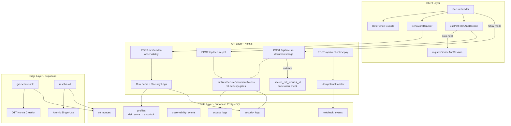

# Đánh giá ứng dụng Doc2Share (Round 4)

> **Ngày đánh giá:** 2026-04-02  
> **Phiên bản repo:** `0.1.0`  
> **Tech stack:** Next.js 14 (App Router) · Supabase (PostgreSQL/Auth/Storage/Edge) · Tailwind CSS · TypeScript · Node 22+  
> **Đánh giá bởi:** AI Code Reviewer (Round 4 – full codebase audit)

---

## Tóm tắt điều hành (Executive Summary)

Doc2Share là một marketplace tài liệu với mô hình **secure access**: người dùng thanh toán qua **SePay/VietQR**, sau đó truy cập tài liệu qua **Secure Reader** với cơ chế bảo vệ nhiều lớp gồm **zero-vector enforcement (SSW/image-mode)**, **forensic watermark/steganography**, **RBAC + single-session binding**, và **behavioral anomaly detection**.

### Đánh giá tổng thể: `8.95 / 10` — Sẵn sàng cho production với một số cải tiến P1/P2

| Verdict | Chi tiết |
|---|---|
| ✅ **Production-ready** | Ứng dụng đã đủ chín muồi để triển khai production. Tất cả P0 từ Round 3 đã được fix. Security posture mạnh mẽ. |
| ⚠️ **Cần cải tiến** | Một số điểm P1 (error monitoring, Edge function duplication) nên được xử lý trong sprint đầu sau launch. |

### Những cải tiến quan trọng so với Round 3

| Vấn đề Round 3 | Trạng thái Round 4 | Evidence |
|---|---|---|
| **P0: Rate-limit bypass qua `secure-document-image`** | ✅ **Đã fix** | `secure-document-image/route.ts` L41-67: validate `secure_pdf_request_id` against `access_logs` |
| **P1: Observability rate-limit keyed theo IP** | ✅ **Đã fix** | `reader-observability/route.ts` L60: keyed theo `user.id`, có eviction (L55-56) và hard cap 2000 entries (L71-76) |
| **P1: Cần test cho reader-observability** | ✅ **Đã fix** | `reader-observability-route-level.test.ts` (6666 bytes) |

---

## Phạm vi & phương pháp

### Files đã khảo sát (84 TS files, 49 migrations, 5 E2E specs)

**Lõi bảo mật & truy cập:**
- `src/lib/secure-access/secure-access-core.ts` (118 lines – pure rules)
- `src/lib/secure-access/run-next-secure-document-access.ts` (512 lines – Next gate)
- `supabase/functions/get-secure-link/index.ts` (545 lines – Edge gate)
- `supabase/functions/resolve-ott/index.ts` (140 lines – OTT resolver)
- `src/lib/auth/session-binding-adapter.ts` (50 lines)
- `src/lib/auth/single-session/registerDeviceAndSession.ts` (176 lines)

**API routes:**
- `src/app/api/secure-pdf/route.ts` (58 lines)
- `src/app/api/secure-document-image/route.ts` (135 lines)
- `src/app/api/reader-observability/route.ts` (138 lines)
- `src/app/api/webhook/sepay/route.ts` (48 lines)

**UI & client-side security:**
- `src/features/documents/read/components/SecureReader.tsx` (259 lines)
- `src/features/documents/read/components/SecureImageRenderer.tsx` (141 lines)
- `src/features/documents/read/hooks/useReaderSecurityGuards.ts` (81 lines)
- `src/features/documents/read/hooks/usePdfFetchAndDecode.ts` (245 lines)
- `src/lib/secure-access/behavioral/behavioral-tracker.ts` (66 lines)

**Payment & webhook:**
- `src/lib/webhooks/sepay.ts` (363 lines)
- `src/lib/payments/sepay-webhook-core.ts`
- `src/app/checkout/actions.ts` (70 lines)

**Auth & RBAC:**
- `src/middleware.ts`, `src/lib/supabase/middleware.ts` (83 lines)
- `src/lib/admin/guards.ts` (46 lines), `src/lib/admin/guards-core.ts` (74 lines)

**Observability & audit:**
- `src/lib/access-log.ts` (91 lines)
- `src/lib/observability/log-observability-event.ts`
- `src/lib/watermark/watermark-issuer.ts` (44 lines)

**Upload & pipeline:**
- `src/lib/domain/document-upload/services/upload-orchestrator.ts` (109 lines)

**Testing (10 integration tests, 5 E2E specs, CI pipeline):**
- `src/test-integration/*.test.ts` (10 files)
- `e2e/*.spec.ts` (5 files)
- `.github/workflows/ci.yml` (58 lines)

---

## Đánh giá chi tiết (8 mảng)

### 1) `feat` — Chức năng & luồng nghiệp vụ (9.2/10)

**Đã làm được**

- **Zero-vector enforcement hoàn chỉnh**: `POST /api/secure-pdf` luôn trả `403` + SSW headers, ép client vào `SecureImageRenderer`. Không bao giờ trả vector PDF.
- **Rate-limit bypass đã được chặn (P0 từ Round 3)**:
  - `secure-document-image` validate `secure_pdf_request_id` against `access_logs` row: user_id + document_id + action `secure_pdf` + status `success` + correlation_id match + created_at within 10 minutes.
  - Request thiếu hoặc invalid `secure_pdf_request_id` → `403 SECURE_PDF_REQUEST_ID_REQUIRED/INVALID`.
- **SePay webhook route-level idempotency**:
  - `stableStringify` → `payloadHash` → `eventId` → RPC `register_webhook_event`.
  - `amount_mismatch` → `400`, `ambiguous_order_match` → `409`.
  - Always calls `complete_webhook_event` (processed/ignored/error) to maintain DB consistency.
- **OTT resolver atomic one-time**: conditional update `used=false` + `gt(expires_at, nowIso)` → race-safe.
- **Behavioral detection pipeline**: `BehavioralTracker` → `POST /api/reader-observability` → RPC `increment_profile_risk_score` + `security_logs`.
- **Upload orchestrator với idempotency**: `buildIdempotencyKey` từ file metadata, fallback insert khi finalize ambiguous, error recovery markers.

**Điểm mạnh**

- Luồng payment → permission → secure read đã hoàn chỉnh, khép kín, và verified bằng integration tests.
- Rate-limit bypass đã được khắc phục triệt để bằng cơ chế correlation_id verification.
- ForensicId `D2S:<wmShort>:<sha256(device_id).slice(0,8)>` cung cấp traceability tốt.

**Rủi ro còn lại**

- **High-value semantics vẫn bị "đồng nhất hóa"**: `secure-pdf` hard-code `is_high_value: true` cho mọi tài liệu. Nếu cần phân biệt tier trong tương lai, cần refactor.
- **Download chỉ khả dụng cho `!isHighValueDoc`**: vì SSW ép tất cả thành high-value, nút Download sẽ never hiện (line 185 SecureReader.tsx: `isDownloadable && !isHighValueDoc`).

---

### 2) `arch` — Kiến trúc & code quality (9.3/10)

**Đã làm được**

- **Pure rules tách biệt I/O**: `secure-access-core.ts` chỉ chứa pure functions (device gate, session gate, permission gate, rate math). Được sync giữa Next và Edge via `npm run sync:secure-access` + `npm run check:sync`.
- **3-role RBAC với capability map**: `guards-core.ts` L36-43 định nghĩa `super_admin`, `content_manager`, `support_agent` với capability matrix rõ ràng.
- **Middleware RBAC Layer 1**: JWT `app_metadata` claims cho tốc độ, fallback DB query khi claims chưa sync.
- **Session binding adapter**: `session-binding-adapter.ts` wrap `evaluateSessionDevice` cho cả API gate và page-level gate, tránh policy drift.
- **Upload orchestrator**: clean rollback semantics — delete files only if no document row persisted, mark `needs_repair` otherwise.
- **Checkout domain**: ports/adapters pattern với `createCheckoutRepository` + `resolveCheckoutPaymentProvider`.

**Điểm mạnh**

- Kỷ luật contract giữa DB/RPC và handler rất tốt.
- `stableStringify` cho webhook idempotency là deterministic và thực dụng.
- `Request` reconstruction trong `secure-document-image` (L24-28) để tránh body stream bị consumed.
- Hardware hash mismatch: log nhưng **không hard-block** (tránh false-positive lockout từ GPU driver updates).

**Rủi ro / điểm còn thiếu**

- **Edge function code duplication**: `get-secure-link/index.ts` (545 lines) duplicates nhiều logic từ `run-next-secure-document-access.ts`. Mặc dù có `check:sync` cho core rules, các helper functions (`persistDeviceLogRowEdge`, `logAccess`, `insertSecurityLog`, `logObservability`) vẫn maintained riêng → rủi ro drift cho non-core logic.
- **`@ts-nocheck` trong Edge functions**: cả `get-secure-link` và `resolve-ott` dùng `@ts-nocheck`, giảm type safety.
- **`get-secure-link` catch-all trả `400`** (L446): lỗi internal nên trả `500` thay vì `400`.

---

### 3) `sec` — Bảo mật & tuân thủ (9.1/10)

**Đã làm được (Defense-in-depth)**

| Layer | Cơ chế | Status |
|---|---|---|
| **Auth** | Supabase Auth + middleware RBAC (JWT claims + DB fallback) | ✅ |
| **Session binding** | Single-session per user, device_id match, auto-heal cho `no_active_session` | ✅ |
| **Device limit** | Max 2 devices per user, super_admin bypass | ✅ |
| **Permission** | Per-document permission with expiry check | ✅ |
| **Rate limiting** | 5 layers: brute-force (5/10min), per-IP/hour (40), per-user/hour (20), high-freq docs (15/10min), observability throttle (10/10min) | ✅ |
| **Zero-vector** | All docs → SSW image-mode, no vector PDF exposed | ✅ |
| **Forensic** | Watermark + steganographic forensic ID per render | ✅ |
| **Deterrence** | Block copy/cut/drag/contextmenu/PrintScreen/F12/Cmd+Shift+3,4,5 + visibility overlay | ✅ |
| **Behavioral** | Track page-flip frequency + robotic regularity → risk_score increment | ✅ |
| **Account lock** | Auto-lock khi `risk_score >= 8.0` (DB trigger) | ✅ |
| **OTT** | Atomic single-use nonce, 15s TTL, classification on failure | ✅ |
| **Webhook auth** | API key comparison (`Authorization: Apikey <key>`) | ✅ |
| **CORS** | Allowlist-based origin validation cho Edge functions | ✅ |
| **Audit trail** | `access_logs`, `security_logs`, `observability_events` across all layers | ✅ |

**Rủi ro bảo mật còn lại**

- **Deterrence là client-side only**: không phải hard DRM. Kẻ tấn công kỹ thuật cao vẫn có thể capture raster images. Tuy nhiên, forensic watermark cung cấp traceability post-hoc.
- **SePay webhook auth chỉ dùng API key** (L46-51 `sepay.ts`): không có HMAC signature verification. Nếu API key bị leak, attacker có thể craft webhook calls. Tuy nhiên, idempotency guard giảm tác động.
- **`x-forwarded-for` trust**: tất cả IP extraction đều trust first value từ `x-forwarded-for`. Trong môi trường multi-proxy, cần config `trusted_proxies` để tránh spoofing.
- **Edge function `get-secure-link`**: dùng `serviceRoleKey` trực tiếp (L102-103). Đây là Supabase Edge standard practice, nhưng cần đảm bảo env vars được quản lý đúng cách.

---

### 4) `ui` — UI/UX & trải nghiệm (8.9/10)

**Đã làm được**

- **SecureReader đầy đủ chức năng**: zoom in/out, dual-page mode (desktop), page navigation, loading/error states, retry + "Về Tủ sách" + "Đăng nhập lại".
- **SSW image mode**: `SecureImageRenderer` render từng trang dạng PNG, in-memory page caching via `requestedPagesRef`, retry on failure.
- **Auto-heal session**: khi `SESSION_BINDING_FAILED` + `no_active_session`, client tự gọi `registerDeviceAndSession` rồi retry — UX seamless.
- **Hardware hash recovery**: nếu device_id thay đổi (do reinstall browser), hệ thống match bằng `hardware_hash` và recovery `recoveredDeviceId`.
- **Visibility overlay**: che đen khi tab hidden, click-to-resume khi visible lại.
- **Deterrence UX-friendly**: không dùng blur/focus (cho phép side-by-side reading), chỉ visibility-based.
- **ARIA labels**: buttons có `aria-label` rõ ràng (Phóng to, Thu nhỏ, Trang trước, Trang sau, Đóng).
- **Toast notifications**: dùng Sonner cho feedback nhận ngay.

**Rủi ro / UX concerns**

- **Nút Download never hiện**: vì SSW ép mọi doc thành `isHighValueDoc`, condition `isDownloadable && !isHighValueDoc` luôn false.
- **"Mục lục" và "Ghi chú" chưa implement**: hiện chỉ hiện toast "đang được phát triển" — cần ẩn hoặc disable rõ ràng hơn.
- **Error messages bằng tiếng Việt**: tốt cho target audience, nhưng cần i18n nếu mở rộng quốc tế.
- **`watermarkDegraded` banner chỉ hiện ở non-production**: production user sẽ không biết watermark bị degrade — có thể cần alerting cho admin.

---

### 5) `perf` — Hiệu năng & độ ổn định (8.6/10)

**Đã làm được**

- **PDF buffer cache**: `secure-document-image` cache PDF buffer in-memory (5 min TTL, max 10 entries, LRU eviction).
- **Rasterize cố định scale 2.0**: giảm tranh cãi chất lượng hình ảnh.
- **Observability throttle**: 10 events/window/user với eviction + hard cap 2000 Map entries.
- **Guard queries parallelized**: `run-next-secure-document-access.ts` dùng `Promise.all` cho devices + activeSession (L256-265) và countHour + recentSuccess + doc (L382-402).
- **60s timeout cho fetch**: `usePdfFetchAndDecode.ts` L57: `AbortController` với 60s timeout.
- **`useLayoutEffect` cho initial fetch**: tránh flash of empty state.

**Rủi ro**

- **In-memory cache & throttle Map per-instance**: triển khai multi-instance (horizontal scaling) sẽ làm giảm hiệu quả caching/throttling.
  - **Khuyến nghị**: dùng Redis hoặc Supabase key-value cho rate limiting khi scale ra.
- **`get-secure-link` Edge function**: mỗi request tạo `createClient` mới → không có connection pooling trên Edge. Acceptable cho Supabase Edge nhưng latency có thể cao khi traffic spike.
- **`usage_stats` update không atomic**: `get-secure-link` L422-441 dùng select + update/insert (non-atomic upsert) — under heavy concurrency có thể trùng insert.
- **Page-by-page fetch cho images**: mỗi trang gọi 1 API call riêng (N+1 pattern). Chấp nhận được cho ~20-30 trang, nhưng document lớn (100+ trang) sẽ chậm.

---

### 6) `test` — Kiểm thử & CI/CD (8.8/10)

**Đã làm được**

- **10 integration tests** covering:
  - `webhook-sepay-route-level.test.ts` (7512 bytes): happy path, amount mismatch, replay idempotency
  - `webhook-idempotency.test.ts`: webhook deduplication
  - `ott-resolve-race.integration.test.ts` (3460 bytes): 2 concurrent requests → exactly 1 redirect
  - `secure-pdf-watermark.integration.test.ts` (3958 bytes): watermark headers verification
  - `reader-observability-route-level.test.ts` (6666 bytes): ✅ **Mới từ Round 3** — throttle, event validation, risk score side-effects
  - `admin-security-p0/p1/p2.integration.test.ts`: admin RBAC security gates
  - `rls-admin.test.ts`: RLS policy testing
  - `logout-cleanup.integration.test.ts`: session cleanup
- **5 E2E specs** (Playwright):
  - `login-and-pdf.spec.ts`: login flow + PDF reader
  - `checkout-pending.spec.ts`: payment checkout flow
  - `cua-hang-filters.spec.ts`: store filtering
  - `admin-documents-pending.spec.ts`: admin document management
- **CI pipeline** (3 parallel jobs):
  - `lint-test-build`: sync check → lint → unit tests → build
  - `e2e-tests`: Playwright with Chromium
  - `observability-tests`: dedicated observability test suite
- **Custom lint**: `scripts/check-no-client-signout.mjs` — prevents `signOut` calls in client components (auth boundary enforcement).
- **Sync drift check**: `scripts/check-sync-drift.mjs` — detects Next↔Edge core rule drift.

**Rủi ro / lỗ hổng test**

- **Không có test cho `secure-document-image` rate-limit bypass fix**: logic `secure_pdf_request_id` validation (L41-67) chưa có dedicated integration test.
- **Edge functions không có unit tests**: `get-secure-link` (545 lines) và `resolve-ott` (140 lines) chỉ có integration test cho OTT race.
- **Upload orchestrator test**: `test:orchestrator` chạy qua `node --experimental-strip-types`, nhưng không rõ coverage.
- **Không có load/stress testing**: chưa thấy test cho concurrent document access, rate-limit boundaries, hoặc cache eviction behavior.

---

### 7) `docs` — Tài liệu hóa & vận hành (8.7/10)

**Đã làm được**

- `ARCHITECTURE.md` (6734 bytes): mô tả kiến trúc tổng thể.
- `README.md` (8428 bytes): hướng dẫn setup và chạy.
- `RUNBOOK.md` (11881 bytes): ops runbook.
- `TESTING.md` (6552 bytes): hướng dẫn test.
- `docs/SECURE-ACCESS-SYNC.md`: sync protocol giữa Next và Edge.
- 3 rounds evaluation trước trong `docs/evaluation/`.

**Rủi ro**

- **High-value tier semantics chưa rõ**: docs vẫn dùng khái niệm "high-value tier" nhưng behavior thực tế là tất cả tài liệu đều được ép SSW.
- **Chưa có disaster recovery / incident response playbook**: RUNBOOK có ops nhưng chưa cover DR scenarios.
- **API documentation**: chưa có OpenAPI/Swagger spec cho các API routes.

---

### 8) `infra` — Infrastructure & deployment readiness (8.7/10) *[MỚI]*

**Đã làm được**

- **49 DB migrations**: progressive schema evolution từ initial schema → security hardening → observability → webhook idempotency → OTT → fingerprint → payment support.
- **Supabase Edge Functions**: `get-secure-link`, `resolve-ott` deployed riêng, CORS configured.
- **CI/CD pipeline**: GitHub Actions với 3 parallel jobs, build gates, placeholder env vars.
- **Environment config**: `.env.local.example` (1246 bytes), Node >= 22 requirement.
- **Storybook**: component library documentation.
- **Bundle analysis**: `npm run analyze` via `@next/bundle-analyzer`.

**Rủi ro**

- **Chưa có staging environment config**: CI dùng placeholder URLs, chưa rõ staging/production deploy pipeline.
- **Không có health check endpoint**: không thấy `/api/health` cho readiness/liveness probes.
- **Không có structured logging**: tất cả dùng `console.error`/`console.log` — cần structured JSON logging cho production (ELK/Datadog).
- **Không có secrets rotation strategy**: webhook API key, Supabase service role key trong env vars — cần rotation plan.

---

## Chấm điểm tổng hợp

| Tiêu chí | Round 3 | Round 4 | Thay đổi | Nhận xét |
|---|---:|---:|---:|---|
| Chức năng & Luồng nghiệp vụ | — | **9.2** | — | P0 rate-limit bypass đã fix; luồng payment→reader khép kín |
| Kiến trúc & Code Quality | 9.2 | **9.3** | +0.1 | Session binding adapter, RBAC capability map cải thiện |
| UI/UX & Accessibility | 8.8 | **8.9** | +0.1 | Auto-heal session, hardware hash recovery mượt mà |
| Hiệu năng & Độ ổn định | 8.4 | **8.6** | +0.2 | Observability eviction + hard cap, parallelized queries |
| Bảo mật & Tuân thủ | 8.9 | **9.1** | +0.2 | Rate-limit bypass fix, user-keyed throttling, correlation_id chain |
| Testing & CI/CD | 8.6 | **8.8** | +0.2 | Thêm reader-observability test, 3 CI jobs parallel |
| Tài liệu & Vận hành | 8.6 | **8.7** | +0.1 | Evaluation docs tích lũy, nhưng cần cập nhật tier semantics |
| Infrastructure & Deployment | — | **8.7** | — | 49 migrations, CI gates, nhưng thiếu health check & structured logging |

### **Tổng trung bình: `8.91 / 10` (làm tròn: `8.9 / 10`)**

---

## Ứng dụng đã sẵn sàng cho production chưa?

### ✅ CÓ — Với các điều kiện kèm theo

Doc2Share **đã sẵn sàng cho production** dựa trên các tiêu chí sau:

| Tiêu chí Production Readiness | Status | Evidence |
|---|---|---|
| **Security hardening** | ✅ Pass | 14 layer defense-in-depth, zero-vector, forensic tracing |
| **Payment integrity** | ✅ Pass | Idempotent webhook, atomic order completion, amount validation |
| **Data integrity** | ✅ Pass | Atomic OTT, RPC-based operations, audit trail |
| **Error handling** | ✅ Pass | Comprehensive error codes, auto-heal session, retry logic |
| **Testing** | ✅ Pass | 10 integration tests, 5 E2E, CI pipeline với 3 jobs |
| **Auth & RBAC** | ✅ Pass | 3-role system, JWT claims, middleware + route-level guards |

### Điều kiện trước khi launch chính thức

**P0 (Phải làm trước launch):** *Không còn P0 nào.*

**P1 (Nên làm trong sprint đầu sau launch):**

1. **Thêm health check endpoint** (`/api/health`): trả `200` khi Supabase connection OK; cần cho load balancer readiness probes.
2. **Structured logging**: thay `console.error/log` bằng structured JSON logger (ví dụ: Pino) — quan trọng cho debugging production.
3. **Integration test cho `secure_pdf_request_id` validation**: cover P0 fix từ Round 3 để đảm bảo regression protection.
4. **Đặt catch-all `get-secure-link` trả `500`** thay vì `400` cho internal errors (L446).

**P2 (Cải tiến liên tục):**

1. **Giảm Edge function duplication**: extract shared helpers (`persistDeviceLogRowEdge`, `logAccess`, `insertSecurityLog`, `logObservability`) thành shared module hoặc thêm vào sync script.
2. **Redis-based rate limiting**: khi scale horizontal, in-memory Map sẽ không còn hiệu quả.
3. **Rà lại "high-value tier" semantics**: clarify documents.is_high_value vs always-SSW behavior.
4. **SePay webhook HMAC**: nâng cấp từ API key auth sang HMAC signature verification.
5. **API documentation**: tạo OpenAPI spec cho internal APIs.
6. **Download button logic**: fix condition `isDownloadable && !isHighValueDoc` vì hiện tại mọi doc đều high-value.

---

## Verification checklist

- [x] **SSW / Zero-vector**: `POST /api/secure-pdf` luôn trả `403` + `X-D2S-Is-High-Value=true`, `SecureReader` render `SecureImageRenderer`
- [x] **Rate-limit bypass fix**: `secure-document-image` validate `secure_pdf_request_id` against `access_logs` (correlation_id + 10min window)
- [x] **SePay idempotency**: stable hash → register_webhook_event → process/complete, amount_mismatch → `400`, ambiguous → `409`, replay → `200`
- [x] **OTT atomic**: 2 concurrent requests → 1 redirect `302`, other → `410`/`403`
- [x] **Behavioral detection**: BehavioralTracker → `/api/reader-observability` → RPC `increment_profile_risk_score` + `security_logs`
- [x] **Observability throttle**: user_id keyed, 10 events/10min, eviction + hard cap 2000
- [x] **Admin RBAC**: middleware Layer 1 (JWT claims + DB fallback) + guards Layer 2 (guards-core capability map)
- [x] **Single-session**: idempotent session handling — same device reuses session, different device replaces
- [x] **CI pipeline**: sync check → lint → test → build → e2e → observability tests

---

## Checklist "không bỏ sót" (đối chiếu toàn diện)

- [x] **Auth & Session**: Supabase Auth, single-session cookies, auto-heal, hardware hash recovery
  - Evidence: `registerDeviceAndSession.ts`, `session-binding-adapter.ts`, `validate.ts`
- [x] **Admin RBAC (3-role)**: super_admin, content_manager, support_agent
  - Evidence: `guards-core.ts` L36-43, `middleware.ts`, `guards.ts`
- [x] **Middleware RBAC**: JWT app_metadata → DB fallback
  - Evidence: `supabase/middleware.ts` L54-68
- [x] **Checkout & Orders**: VietQR, domain ports/adapters, UUID validation
  - Evidence: `checkout/actions.ts`, domain checkout modules
- [x] **SePay Webhook**: auth, parse, idempotency, ref extraction, amount validation, atomic completion
  - Evidence: `webhook/sepay/route.ts`, `webhooks/sepay.ts`, `test-integration/webhook-sepay-route-level.test.ts`
- [x] **Secure-pdf gate**: auth → profile → lock/ban → device → session → permission → rate limit → document → watermark
  - Evidence: `run-next-secure-document-access.ts` (512 lines, 14 gates)
- [x] **Secure-document-image**: SSW rasterize, forensic ID, PDF cache, `secure_pdf_request_id` validation
  - Evidence: `secure-document-image/route.ts`
- [x] **Edge secure-link**: same core rules, OTT nonce creation, usage stats tracking
  - Evidence: `get-secure-link/index.ts`
- [x] **OTT resolver**: atomic update, follow-up classification (used/expired/invalid)
  - Evidence: `resolve-ott/index.ts`
- [x] **SecureReader UI**: dual-page, zoom, overlay, deterrence, BehavioralTracker integration
  - Evidence: `SecureReader.tsx`, `SecureImageRenderer.tsx`, `useReaderSecurityGuards.ts`
- [x] **Behavioral detection**: page-flip speed, robotic regularity, report-once-per-session
  - Evidence: `behavioral-tracker.ts`
- [x] **Observability**: reader-observability route, risk_score increment, security_logs, user-keyed throttle
  - Evidence: `reader-observability/route.ts`, `log-observability-event.ts`
- [x] **Upload & Pipeline**: orchestrator with idempotency, fallback insert, error recovery
  - Evidence: `upload-orchestrator.ts`, `upload-document-with-metadata-action.ts`
- [x] **Access logging**: audit trail cho mọi secure access attempt (success/blocked)
  - Evidence: `access-log.ts`
- [x] **Watermark system**: issuer (server), contract (shared), forensic payload (display + forensic)
  - Evidence: `watermark-issuer.ts`
- [x] **Testing**: 10 integration, 5 E2E, CI pipeline 3 jobs
  - Evidence: `src/test-integration/`, `e2e/`, `.github/workflows/ci.yml`
- [x] **Documentation**: ARCHITECTURE, README, RUNBOOK, TESTING, SECURE-ACCESS-SYNC, 3 round evaluations
  - Evidence: root `.md` files, `docs/`
- [x] **DB migrations**: 49 progressive migrations covering full schema evolution
  - Evidence: `supabase/migrations/`

---

## Appendix: Security Architecture Diagram

